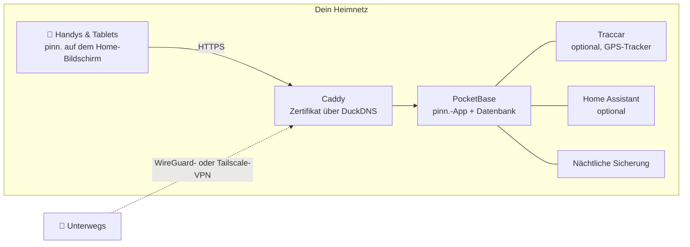

<p align="center">
  
</p>

<p align="center">
  <a href="https://github.com/pinn-shost/pinn/releases/latest"></a>
  <a href="LICENSE"></a>
  
  
  
  <a href="https://ko-fi.com/pinnapp"></a>
</p>

<p align="center">
  <a href="#bildschirmfotos">Bildschirmfotos</a> ·
  <a href="#was-pinn-kann">Funktionen</a> ·
  <a href="#installation">Installation</a> ·
  <a href="#datenschutz">Datenschutz</a> ·
  <a href="#häufige-fragen">Häufige Fragen</a> ·
  <a href="README.md">🇬🇧 English</a>
</p>

---

pinn. ist eine App für alles, was einen Haushalt am Laufen hält: der gemeinsame Kalender, das Essen der Woche, die Einkaufsliste, wer den Müll rausbringt, das Taschengeld und die Versicherung, die im März gekündigt werden muss. Sie läuft auf **deinem eigenen NAS** mit Docker und lässt sich auf jedem iPhone, iPad und Android-Handy der Familie wie eine echte App auf den Home-Bildschirm legen.

Kein Cloud-Konto. Kein Abo. Keine Werbung, kein Tracking. Die Daten deiner Familie verlassen dein Zuhause nie.

## Bildschirmfotos

<table>
  <tr>
    <td align="center" width="33%"><br><sub><b>Übersicht</b> – dein Tag auf einen Blick</sub></td>
    <td align="center" width="33%"><br><sub><b>Kalender</b> – iCloud und Google in einer Ansicht</sub></td>
    <td align="center" width="33%"><br><sub><b>Essen</b> – Woche planen, mit einem Tipp einkaufen</sub></td>
  </tr>
  <tr>
    <td align="center"><br><sub><b>Listen</b> – Einkauf, Vorrat, Packen</sub></td>
    <td align="center"><br><sub><b>Finanzen</b> – Budget, Sparen, Taschengeld</sub></td>
    <td align="center"><br><sub><b>Kinder</b> – eine spielerische Tagesroutine</sub></td>
  </tr>
</table>

## Was pinn. kann

| | |
|---|---|
| 📅 **Kalender** | iCloud- und Google-Kalender pro Person, privat oder mit der Familie geteilt. Feiertage, Schulferien, Müll-Termine und Geburtstage aus deinen Kontakten erscheinen automatisch. |
| 🍝 **Essen & Rezepte** | Woche planen und die Zutaten direkt auf die Einkaufsliste schicken. Rezepte aus Text, PDF, Fotos oder einem Link importieren – optional mit KI. Lieblingsrezepte können mit anderen Familien auf deinem Server geteilt werden. |
| 🛒 **Listen** | Einkaufslisten pro Laden, ein Vorrat, der die Liste auffüllt, wenn etwas knapp wird, Packlisten aus Vorlagen (Urlaub, Krankenhaustasche, Party), Geschenk- und Wunschlisten. |
| ✅ **Aufgaben & Haushalt** | Aufgaben mit Push-Erinnerungen, Putzpläne und Mülltermine – dazu eine Kinderseite mit animierten Routinen, die nur zeigt, was zur Tageszeit passt. |
| 💶 **Finanzen** | Gemeinsame oder private Kassen, ein Haushaltsbudget, Sparen und Depots mit ETFs und Aktien, Taschengeld, regelmäßige Zahlungen und Verträge mit Kündigungserinnerung. WGs können Kosten teilen und sehen, wer wem Geld schuldet. |
| 📄 **Dokumente & Fahrzeuge** | Belege und Garantien, Ausweise mit Ablauferinnerung. Autos und Fahrräder mit TÜV-Terminen, Reifenwechsel, Verbrauch und Gesamtkosten. |
| 🏡 **Zuhause** | Für Mieter, Eigentümer und Vermieter: Miet- oder Kaufvertrag, Kredit, Mängel mit Fotos, Rechnungen, Sanierungsplan, Zählerstände mit Prognose, Schlüssel und Mieteinnahmen für Wohnungen, Häuser und Garagen, die du vermietest. Garten & Pflanzen mit Gießplan, der weiß, wann es geregnet hat. |
| 📍 **Familie & Standort** | Standort direkt aus pinn. teilen – einmalig oder für eine gewählte Zeit – und im Hintergrund über die kostenlose App Traccar Client (sendet direkt an pinn., kein zusätzlicher Server nötig). Dazu ein Heimweg-Modus, ein SOS-Alarm mit Standort und Notrufnummern, Notfallpässe und Benachrichtigungen beim Ankommen an Orten. |
| 🎒 **Schule & Kita** | Pro Kind: Stundenplan (eintippen oder Foto machen – die KI füllt ihn aus), Bringen und Abholen, Hausaufgaben auf der Kinderseite, Elternbriefe mit Fristen, die zu Erinnerungen werden, und Schließtage direkt im Kalender. |
| 🐾 **Haustiere** | Profile für Hund, Katze, Kaninchen & Co. mit Fütterungszeiten zum Abhaken, Gassi-Runden, einem Dienstplan „Wer ist dran?“, Impfungen und Wurmkur mit Push-Erinnerungen, Gewichtsverlauf, Tierarzt und Tiernotdienst, einem Steckbrief für den Tiersitter zum Teilen und einem druckbaren Vermisst-Plakat. |
| 🌦️ **Wetter & Urlaub** | Tipp auf die Wetter-Kachel: 14 Tage mit Details für jeden Tag. Packlisten mit Reiseziel und Zeitraum zeigen das Wetter am Urlaubsort – Vorhersage oder Erfahrungswerte – und schlagen vor, was man einpacken sollte. |
| 🏠 **Smarthome** | Apple-Kurzbefehle oder Home-Assistant-Aktionen direkt aus einer Aufgabe starten – der Saugroboter putzt die Küche, wenn die Aufgabe fällig ist. |
| 🎙️ **Sprachsteuerung** | „Hey Siri, pinn“: auf die Einkaufsliste setzen, vorlesen lassen, Aufgaben anlegen und hören, was heute ansteht – auch unter Android. |
| 🧩 **Alles andere** | Pinnwand mit verschiebbaren Zetteln, globale Suche, Offline-Betrieb mit automatischer Synchronisation, Dunkelmodus, Übersicht für das iPad mit PIN-geschützten Profilen, Gastkonto, Kindersicherung. |

pinn. spricht **Englisch, Deutsch, Französisch und Spanisch**, passt Währung und Notrufnummern an deine Region an und wechselt zwischen Familien- und WG-Sprache. Ein Server kann mehrere Familien beherbergen, jede mit eigenen Admins.

## Was ist neu in 1.40

**Der App-Code wird in einzelne Dateien aufgeteilt (Teil 1)**

- **Erster Schritt zu kleineren Dateien:** Die Web-App war bisher eine riesige `index.html` mit über 50.000 Zeilen JavaScript. Sie wird jetzt Schritt für Schritt in einfache Skriptdateien unter `pb_public/js/` verschoben – ohne Build-Schritt, ohne Framework, nur `<script src>`. Aussehen und Bedienung bleiben genau gleich.
- **Erste Datei: `js/ausblick.js`** – die Wochenvorschau und der Monatsausblick Finanzen. Sie wird als letzte geladen und startet die App.
- **Offline wie gewohnt:** Der Service Worker (`sw.pb.js`) hält die Dateien aus `js/` jetzt auf dem Gerät vor und räumt alte Fassungen selbst auf.
- **Klare Startprüfung:** Fehlt auf dem NAS eine Datei in `pb_public/js/`, zeigt pinn. welche – statt einer leeren Seite.
- Installieren und Aktualisieren wie gewohnt (`sudo sh pinn-*/pinn-setup.sh` oder der Update-Knopf). Deine Daten bleiben unberührt.

## So funktioniert es



Alles läuft als Docker-Container auf einem Gerät. HTTPS funktioniert **ohne Portfreigabe** – das Zertifikat wird über eine DNS-Prüfung ausgestellt. Von außen ist pinn. nur über dein eigenes VPN erreichbar.

## Voraussetzungen

- Ein NAS oder Server mit **Docker** und **Docker Compose 2.17+** – entwickelt auf einem UGREEN-NAS mit UGOS, läuft auf jedem Linux-Docker-Host (amd64, arm64, armv7)
- SSH-Zugang dazu
- Optional, aber empfohlen: eine kostenlose Subdomain bei [DuckDNS](https://www.duckdns.org) für HTTPS – nötig für Push-Benachrichtigungen und die Installation als App

## Installation

1. Lade das ZIP der [neuesten Version](https://github.com/pinn-shost/pinn/releases/latest) herunter und entpacke es.
2. Lege auf dem NAS einen Ordner an, z. B. `/volume1/docker/Pocketbase`, und kopiere den entpackten Ordner (z. B. `pinn-1.40.0` oder `pinn-main`) unverändert hinein.
3. Melde dich per SSH an und führe aus:
   ```sh
   cd /volume1/docker/Pocketbase && sudo sh pinn-*/pinn-setup.sh
   ```
   Das Skript kopiert alle Dateien an ihren Platz, lädt die Bibliotheken für den PDF-Import und die Texterkennung auf Fotos und startet pinn.
4. Öffne `http://<NAS-IP>:8090` → **Als Hauptadmin anmelden** → Passwort `Admin` → wähle ein eigenes Passwort.
5. Der **Einrichtungsassistent** führt dich durch den Rest – HTTPS, Zugriff von unterwegs per WireGuard oder Tailscale, Google, KI, Standort und Home Assistant – Schritt für Schritt, in vier Sprachen.
6. Öffne pinn. auf jedem Handy über seine HTTPS-Adresse und lege es auf den Home-Bildschirm:
   - **iPhone/iPad (Safari):** Teilen → *Zum Home-Bildschirm* (iOS 16.4 oder neuer für Benachrichtigungen)
   - **Android (Chrome):** Einstellungen → Benachrichtigungen → *pinn. als App installieren*, oder Chrome-Menü ⋮ → *App installieren*

   Danach die Benachrichtigungen auf jedem Gerät unter **Einstellungen → Benachrichtigungen → Auf diesem Gerät aktivieren** einschalten.

**Aktualisieren:** Lade das neue ZIP herunter, kopiere den entpackten Ordner in denselben Ordner und führe `sudo sh pinn-*/pinn-setup.sh` erneut aus. Ersetzte Dateien landen in `_alt/`, deine Daten bleiben unberührt.

**Sicherungen** laufen jede Nacht nach `./backups` und werden 14 Tage aufbewahrt.

## Datenschutz

pinn. ist für Daten gebaut, die man keinem Cloud-Dienst anvertrauen würde: Kontoauszüge, Gesundheitsunterlagen, wo sich die Kinder gerade aufhalten. Deshalb gilt:

- **Alle Daten liegen auf deinem NAS** in einer einzigen PocketBase-Datenbank. Es gibt keinen pinn.-Server und keine Telemetrie.
- **Keine Skripte von fremden Servern.** Aller Code und alle Bibliotheken werden von deinem NAS ausgeliefert.
- **Push-Nachrichten enthalten keinen Inhalt.** Apple, Google und Mozilla übermitteln nur ein leeres Wecksignal; das Gerät holt die Nachricht danach von deinem NAS.
- **Passwörter für iCloud und Google** werden verschlüsselt in einer gesperrten Sammlung gespeichert.
- **Nicht aus dem Internet erreichbar.** Der Zugriff von unterwegs läuft über dein eigenes VPN.

pinn. nimmt nur für Funktionen Kontakt zu externen Diensten auf, die sie brauchen:

| Dienst | Wofür | Wann |
|---|---|---|
| [Open-Meteo](https://open-meteo.com) | Wettervorhersage | wenn eine Wohnadresse hinterlegt ist |
| [OpenStreetMap Nominatim](https://nominatim.openstreetmap.org) | Adressen in Kartenpositionen umrechnen | bei der Eingabe von Adressen |
| [OpenStreetMap-Kacheln](https://www.openstreetmap.org) | Kartenhintergrund | auf der Standortseite, über dein NAS geladen |
| [Google Fonts](https://fonts.google.com) | Schriftarten | beim Laden der App |
| [OpenHolidays API](https://www.openholidaysapi.org) | Feiertage und Schulferien | wenn eine Wohnadresse hinterlegt ist |
| [DuckDNS](https://www.duckdns.org) | HTTPS-Zertifikat und Adresse | falls eingerichtet |
| iCloud / Google | Kalender und Kontakte | nur für Konten, die du verbindest |
| Google Gemini | Rezepte und Dokumente auslesen | nur wenn du einen API-Schlüssel einträgst |
| jsDelivr | einmaliger Download von pdf.js und Tesseract | nur während der Installation |

## Häufige Fragen

<details>
<summary><b>Muss ich Ports an meinem Router öffnen?</b></summary>
<br>
Nein. Das HTTPS-Zertifikat wird über eine DNS-Prüfung ausgestellt, und der Zugriff von unterwegs läuft über ein VPN – WireGuard bei der FRITZ!Box, Tailscale bei jedem anderen Router.
</details>

<details>
<summary><b>Geht das auch ohne NAS?</b></summary>
<br>
Jedes Gerät, das dauerhaft läuft und Docker kann, funktioniert: ein Mini-PC, ein Raspberry Pi 4/5 oder ein Linux-Server.
</details>

<details>
<summary><b>Ist pinn. eine „richtige“ App aus dem App Store?</b></summary>
<br>
pinn. ist eine Web-App, die du auf den Home-Bildschirm legst. Sie öffnet sich dann im Vollbild wie eine native App, funktioniert offline, zeigt eine Zahl mit den offenen Aufgaben und empfängt Push-Nachrichten – ganz ohne App Store.
</details>

<details>
<summary><b>Können mehrere Familien eine Installation nutzen?</b></summary>
<br>
Ja. Der Hauptadmin legt Familien an, jede Familie bekommt eigene Admins, Kalender und Daten. Rezepte können optional zwischen Familien geteilt werden.
</details>

<details>
<summary><b>Und die Kinder?</b></summary>
<br>
Profile mit Kindersicherung sehen nur ihre eigenen Aufgaben und können nichts löschen oder ändern. Finanzen, Dokumente und Fahrzeuge bleiben ausgeblendet. Jüngere Kinder bekommen eine eigene spielerische Seite mit Tagesroutinen.
</details>

<details>
<summary><b>Was kostet es?</b></summary>
<br>
Nichts – pinn. ist kostenlos und Open Source unter der MIT-Lizenz. Optionale Dienste wie die KI von Gemini haben kostenlose Kontingente.
</details>

## Aufbau des Repositorys

Das Repository hat denselben Aufbau wie eine Installation auf dem NAS – jede Datei liegt dort, wo sie später landet:

```
pinn/
├── pb_hooks/            Server: *.pb.js-Hooks und ihre Hilfsmodule (pinn-*.js, calendar-sync.js)
├── pb_public/           Web-App, von PocketBase ausgeliefert
│   ├── index.html       die App (HTML, Gestaltung und der größte Teil des Codes)
│   ├── js/              aus der index.html ausgelagerter App-Code, einfache <script>-Dateien ohne Build-Schritt
│   ├── einrichtung.js   Einrichtungsassistent · datenexport.js  Datenexport
│   ├── lang/            Übersetzungen (en, fr, es)
│   └── vendor/          pinn.css, pocketbase/ (pdf.js und Tesseract lädt die Installation nach)
├── caddy/Caddyfile      HTTPS-Reverse-Proxy
├── docker-compose.yaml  alle Container
├── env.txt              Vorlage für .env
├── pinn-setup.sh        Installation & Aktualisierung
├── pinn-wartung.sh      Sicherungen & Updates (Container „wartung“)
├── pinn-pocketbase-update.sh
└── index.html           nur Platzhalter, wird nie installiert (damit der Update-Knopf von 1.38 weiter funktioniert)
```

`pinn-setup.sh` kopiert `pb_hooks/`, `pb_public/` und `caddy/Caddyfile` unverändert in den Projektordner; Datenordner (`pb_data/`, `konfig/`, `backups/`, `caddy/data/` …) werden nie angefasst.

## Mitmachen

Fehlerberichte, Ideen und Übersetzungen sind sehr willkommen – siehe [CONTRIBUTING.md](.github/CONTRIBUTING.md). Sicherheitslücken bitte vertraulich melden, wie in [SECURITY.md](.github/SECURITY.md) beschrieben.

## pinn. unterstützen

pinn. ist und bleibt kostenlos – vollständig, für alle. Es entsteht in meiner Freizeit. Wenn es dir den Alltag ein Stück leichter macht, freue ich mich über einen kleinen Beitrag, der aber völlig freiwillig ist:

<p>
  <a href="https://ko-fi.com/pinnapp"></a>
  <a href="https://buymeacoffee.com/pinn"></a>
</p>

Ein ⭐ hilft übrigens auch – damit finden andere Familien pinn. leichter.

## Verwendete Software

[PocketBase](https://pocketbase.io) (MIT) · [Tailwind CSS](https://tailwindcss.com) (MIT) · [pdf.js](https://mozilla.github.io/pdf.js/) (Apache-2.0) · [Tesseract.js](https://tesseract.projectnaptha.com) (Apache-2.0) · [Traccar](https://www.traccar.org) (Apache-2.0) · [Caddy](https://caddyserver.com) (Apache-2.0)

## Lizenz

[MIT](LICENSE) – benutzen, ändern, weitergeben.
