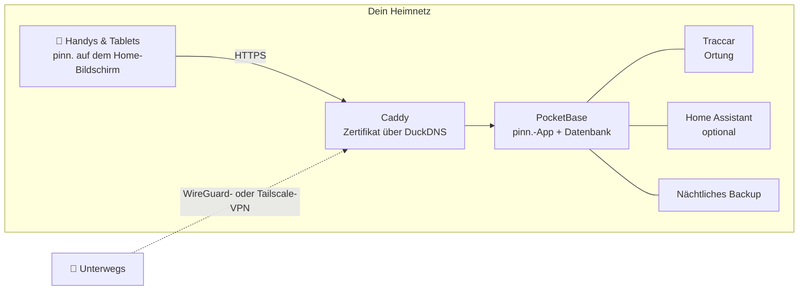

<p align="center">
  
</p>

<p align="center">
  <a href="https://github.com/pinn-shost/pinn/releases/latest"></a>
  <a href="LICENSE"></a>
  
  
  
  <a href="https://ko-fi.com/pinnapp"></a>
</p>

<p align="center">
  <a href="#screenshots">Screenshots</a> ·
  <a href="#was-pinn-kann">Funktionen</a> ·
  <a href="#installation">Installation</a> ·
  <a href="#datenschutz">Datenschutz</a> ·
  <a href="#häufige-fragen">FAQ</a> ·
  <a href="README.md">🇬🇧 English</a>
</p>

---

pinn. ist eine App für alles, was einen Haushalt am Laufen hält: der gemeinsame Kalender, das Essen der Woche, die Einkaufsliste, wer den Müll rausbringt, das Taschengeld und die Versicherung, die im März gekündigt werden muss. Sie läuft auf **deinem eigenen NAS** mit Docker und lässt sich auf jedem iPhone, iPad und Android-Handy der Familie wie eine echte App installieren.

Kein Cloud-Konto. Kein Abo. Keine Werbung, kein Tracking. Die Daten deiner Familie verlassen nie dein Zuhause.

## Screenshots

<table>
  <tr>
    <td align="center" width="33%"><br><sub><b>Übersicht</b> – dein Tag auf einen Blick</sub></td>
    <td align="center" width="33%"><br><sub><b>Kalender</b> – iCloud und Google in einer Ansicht</sub></td>
    <td align="center" width="33%"><br><sub><b>Essen</b> – Woche planen, mit einem Tipp einkaufen</sub></td>
  </tr>
  <tr>
    <td align="center"><br><sub><b>Listen</b> – Einkauf, Vorrat, Packen</sub></td>
    <td align="center"><br><sub><b>Finanzen</b> – Budget, Sparen, Taschengeld</sub></td>
    <td align="center"><br><sub><b>Kinder</b> – ein spielerischer Tagesablauf</sub></td>
  </tr>
</table>

## Was pinn. kann

| | |
|---|---|
| 📅 **Kalender** | iCloud- und Google-Kalender pro Person, privat oder mit der Familie geteilt. Feiertage, Schulferien, Müllabfuhr-Termine und Geburtstage aus deinen Kontakten erscheinen automatisch. |
| 🍝 **Essen & Rezepte** | Die Woche planen und die Zutaten direkt auf die Einkaufsliste schicken. Rezepte aus Text, PDF, Fotos oder Link importieren – auf Wunsch mit KI. Lieblingsrezepte mit anderen Familien auf deinem Server teilen. |
| 🛒 **Listen** | Einkaufslisten pro Laden, ein Vorrat, der die Liste auffüllt, wenn etwas zur Neige geht, Packlisten aus Vorlagen (Urlaub, Kliniktasche, Party), Geschenk- und Wunschlisten. |
| ✅ **Aufgaben & Haushalt** | Aufgaben mit Push-Erinnerungen, Putzpläne und Mülltonnen – dazu eine Kinderseite mit animierten Tagesabläufen, die nur zeigt, was zur Tageszeit passt. |
| 💶 **Finanzen** | Geteilte oder private Kassen, ein Haushaltsbudget, Sparen und Depots mit ETFs und Aktien, Taschengeld, regelmäßige Zahlungen und Verträge mit Kündigungserinnerung. WGs können Kosten aufteilen und sehen, wer wem etwas schuldet. |
| 📄 **Dokumente & Fahrzeuge** | Rechnungen und Garantien, Ausweise mit Ablauf-Erinnerung. Autos und Fahrräder mit TÜV-Terminen, Reifenwechsel, Verbrauch und Gesamtkosten. |
| 📍 **Familie & Ortung** | Live-Standort über die kostenlose App Traccar Client, ein Heimweg-Modus, SOS-Alarm mit Position und Notrufnummern, Notfallpässe und Ankunfts-Benachrichtigungen für Orte. |
| 🎒 **Schule & Kita** | Pro Kind: Stundenplan (eintippen oder abfotografieren – die KI füllt ihn aus), Bringen und Abholen, Hausaufgaben auf der Kinderseite, Elternbriefe mit Fristen als Erinnerung und Schließtage direkt im Kalender. |
| 🏠 **Smarthome** | Apple-Kurzbefehle oder Home-Assistant-Aktionen aus einer Aufgabe starten – der Saugroboter putzt die Küche, wenn die Aufgabe fällig ist. |
| 🔔 **Benachrichtigungen** | Persönliche Push-Nachrichten auf iPhone, iPad und Android, dazu eine Glocke, die jede Änderung in der Familie sammelt. |
| 🧩 **Alles andere** | Familien-Pinnwand mit verschiebbaren Zetteln, globale Suche, Offline-Modus mit automatischem Abgleich, Dunkelmodus, iPad-Dashboard mit Profil-PINs, Gastkonto, Kindersicherung. |

pinn. spricht **English, Deutsch, Français und Español**, passt Währung und Notrufnummern an deine Region an und wechselt zwischen **Familien-** und **WG-**Begriffen. Ein Server kann mehrere Familien beherbergen, jede mit eigenen Admins.

## So funktioniert's



Alles läuft als Docker-Container auf einem Gerät. HTTPS funktioniert **ohne Portfreigabe** – das Zertifikat wird über eine DNS-Prüfung ausgestellt. Von außen ist pinn. nur über dein eigenes VPN erreichbar.

## Voraussetzungen

- Ein NAS oder Server mit **Docker** und **Docker Compose 2.17+** – entwickelt auf einem UGREEN-NAS mit UGOS, läuft auf jedem Linux-Docker-Host (amd64, arm64, armv7)
- SSH-Zugang dazu
- Optional, aber empfohlen: eine kostenlose [DuckDNS](https://www.duckdns.org)-Subdomain für HTTPS – nötig für Push-Benachrichtigungen und um pinn. als App zu installieren

## Installation

1. Die ZIP-Datei der [neuesten Version](https://github.com/pinn-shost/pinn/releases/latest) herunterladen und entpacken.
2. Auf dem NAS einen Ordner anlegen, z. B. `/volume1/docker/Pocketbase`, und den entpackten Ordner (z. B. `pinn-1.22.1` oder `pinn-main`) so wie er ist hineinlegen.
3. Per SSH anmelden und ausführen:
   ```sh
   cd /volume1/docker/Pocketbase && sudo sh pinn-*/pinn-setup.sh
   ```
   Das Skript sortiert alle Dateien an ihren Platz, lädt die Bibliotheken für PDF-Import und Texterkennung auf Fotos herunter und startet pinn.
4. `http://<NAS-IP>:8090` öffnen → **Als Hauptadmin anmelden** → Passwort `Admin` → eigenes Passwort wählen.
5. Der **Einrichtungsassistent** führt dich durch den Rest – HTTPS, Fernzugriff über WireGuard oder Tailscale, Google, KI, Ortung und Home Assistant – Schritt für Schritt, in vier Sprachen.
6. pinn. auf jedem Handy über die HTTPS-Adresse öffnen und zum Home-Bildschirm hinzufügen:
   - **iPhone/iPad (Safari):** Teilen → *Zum Home-Bildschirm* (ab iOS 16.4 für Benachrichtigungen)
   - **Android (Chrome):** Einstellungen → Benachrichtigungen → *pinn. als App installieren*, oder Chrome-Menü ⋮ → *App installieren*

   Danach auf jedem Gerät die Benachrichtigungen einschalten unter **Einstellungen → Benachrichtigungen → Auf diesem Gerät aktivieren**.

**Aktualisieren:** die neue ZIP herunterladen, den entpackten Ordner in denselben Ordner legen und `sudo sh pinn-*/pinn-setup.sh` erneut ausführen. Ersetzte Dateien landen in `_alt/`, deine Daten bleiben unberührt.

**Backups** laufen jede Nacht nach `./backups` und werden 14 Tage aufbewahrt.

## Datenschutz

pinn. ist für Daten gebaut, die man nie einem Cloud-Dienst geben würde: Kontoauszüge, Gesundheitsdokumente, wo die eigenen Kinder sind. Deshalb:

- **Alle Daten liegen auf deinem NAS** in einer einzigen PocketBase-Datenbank. Es gibt keinen pinn.-Server und keine Telemetrie.
- **Keine Skripte von fremden Servern.** Sämtlicher Code und alle Bibliotheken kommen von deinem NAS.
- **Push-Nachrichten enthalten keine Inhalte.** Apple, Google und Mozilla stellen nur ein leeres Wecksignal zu; das Gerät holt die Nachricht dann von deinem NAS.
- **Passwörter für iCloud und Google** werden verschlüsselt in einer gesperrten Collection gespeichert.
- **Nicht aus dem Internet erreichbar.** Fernzugriff läuft über dein eigenes VPN.

pinn. kontaktiert externe Dienste nur für Funktionen, die sie brauchen:

| Dienst | Wofür | Wann |
|---|---|---|
| [Open-Meteo](https://open-meteo.com) | Wettervorhersage | wenn ein Zuhause hinterlegt ist |
| [OpenStreetMap Nominatim](https://nominatim.openstreetmap.org) | Adressen in Kartenpositionen umwandeln | beim Eingeben von Adressen |
| [OpenStreetMap-Kacheln](https://www.openstreetmap.org) | Kartenhintergrund | auf der Ortungsseite, über dein NAS geladen |
| [Google Fonts](https://fonts.google.com) | Schriften | beim Laden der App |
| [OpenHolidays API](https://www.openholidaysapi.org) | Feiertage und Schulferien | wenn ein Zuhause hinterlegt ist |
| [DuckDNS](https://www.duckdns.org) | HTTPS-Zertifikat und Adresse | falls eingerichtet |
| iCloud / Google | Kalender und Kontakte | nur für Konten, die du verbindest |
| Google Gemini | Rezepte und Dokumente auslesen | nur wenn du einen API-Schlüssel hinterlegst |
| jsDelivr | Einmaliger Download von pdf.js und Tesseract | nur bei der Installation |

## Häufige Fragen

<details>
<summary><b>Muss ich Ports am Router freigeben?</b></summary>
<br>
Nein. Das HTTPS-Zertifikat wird über eine DNS-Prüfung ausgestellt, und der Fernzugriff läuft über ein VPN – WireGuard auf einer FRITZ!Box oder Tailscale für jeden anderen Router.
</details>

<details>
<summary><b>Geht es auch ohne NAS?</b></summary>
<br>
Jedes dauerhaft laufende Gerät mit Docker funktioniert: ein Mini-PC, ein Raspberry Pi 4/5 oder ein Linux-Server.
</details>

<details>
<summary><b>Ist pinn. eine „echte“ App aus dem App Store?</b></summary>
<br>
pinn. ist eine Web-App, die du zum Home-Bildschirm hinzufügst. Sie öffnet sich dann im Vollbild wie eine echte App, funktioniert offline, zeigt ein Badge mit offenen Aufgaben und empfängt Push-Nachrichten – ganz ohne App Store.
</details>

<details>
<summary><b>Können mehrere Familien eine Installation nutzen?</b></summary>
<br>
Ja. Der Hauptadmin legt Familien an, jede Familie bekommt eigene Admins, Kalender und Daten. Rezepte lassen sich auf Wunsch zwischen Familien teilen.
</details>

<details>
<summary><b>Und die Kinder?</b></summary>
<br>
Profile mit Kindersicherung sehen nur ihre eigenen Aufgaben und können nichts löschen oder ändern. Finanzen, Dokumente und Fahrzeuge bleiben ausgeblendet. Jüngere Kinder bekommen eine eigene, spielerische Seite mit Tagesabläufen.
</details>

<details>
<summary><b>Was kostet es?</b></summary>
<br>
Nichts – pinn. ist kostenlos und Open Source unter der MIT-Lizenz. Optionale Dienste wie die Gemini-KI haben kostenlose Kontingente.
</details>

## Mitmachen

Fehlermeldungen, Ideen und Übersetzungen sind sehr willkommen – siehe [CONTRIBUTING.md](.github/CONTRIBUTING.md). Sicherheitslücken bitte vertraulich melden, wie in [SECURITY.md](.github/SECURITY.md) beschrieben.

## pinn. unterstützen

pinn. ist kostenlos und bleibt es – komplett, für alle. Es entsteht in meiner Freizeit. Wenn es deinen Alltag ein bisschen leichter macht, freue ich mich über eine kleine Unterstützung, ganz freiwillig:

<p>
  <a href="https://ko-fi.com/pinnapp"></a>
  <a href="https://buymeacoffee.com/pinn"></a>
</p>

Ein ⭐ hilft auch – so finden andere Familien pinn. leichter.

## Gebaut mit

[PocketBase](https://pocketbase.io) (MIT) · [Tailwind CSS](https://tailwindcss.com) (MIT) · [pdf.js](https://mozilla.github.io/pdf.js/) (Apache-2.0) · [Tesseract.js](https://tesseract.projectnaptha.com) (Apache-2.0) · [Traccar](https://www.traccar.org) (Apache-2.0) · [Caddy](https://caddyserver.com) (Apache-2.0)

## Lizenz

[MIT](LICENSE) – nutzen, verändern, weitergeben.
