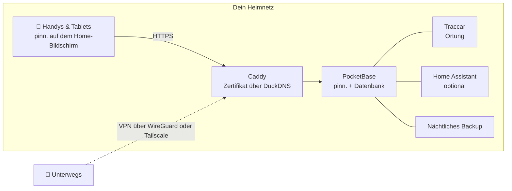

<p align="center">
  
</p>

<p align="center">
  <a href="https://github.com/pinn-shost/pinn/releases/latest"></a>
  <a href="LICENSE"></a>
  
  
  <a href="https://ko-fi.com/pinnapp"></a>
</p>

<p align="center">
  <a href="#bilder">Bilder</a> ·
  <a href="#was-pinn-kann">Funktionen</a> ·
  <a href="#installation">Installation</a> ·
  <a href="#datenschutz">Datenschutz</a> ·
  <a href="#häufige-fragen">Fragen</a> ·
  <a href="README.md">🇬🇧 English</a>
</p>

---

pinn. ist eine App für alles, was einen Haushalt am Laufen hält: der gemeinsame Kalender, das Essen dieser Woche, die Einkaufsliste, wer den Müll rausbringt, das Taschengeld und die Versicherung, die im März gekündigt werden muss. Sie läuft auf **deinem eigenen NAS** mit Docker und lässt sich auf jedem iPhone, iPad und Android-Handy der Familie wie eine echte App installieren.

Kein Cloud-Konto. Kein Abo. Keine Werbung, kein Tracking. Die Daten eurer Familie verlassen nie euer Zuhause.

## Bilder

<table>
  <tr>
    <td align="center" width="33%"><br><sub><b>Übersicht</b> – der Tag auf einen Blick</sub></td>
    <td align="center" width="33%"><br><sub><b>Kalender</b> – iCloud und Google in einer Ansicht</sub></td>
    <td align="center" width="33%"><br><sub><b>Essen</b> – Woche planen, mit einem Tipp einkaufen</sub></td>
  </tr>
  <tr>
    <td align="center"><br><sub><b>Listen</b> – Einkauf, Vorrat, Packen</sub></td>
    <td align="center"><br><sub><b>Finanzen</b> – Budget, Sparen, Taschengeld</sub></td>
    <td align="center"><br><sub><b>Kinder</b> – der Tagesablauf zum Abhaken</sub></td>
  </tr>
</table>

## Was pinn. kann

| | |
|---|---|
| 📅 **Kalender** | iCloud- und Google-Kalender je Person, privat oder mit der Familie geteilt. Feiertage, Schulferien, Müllabfuhr und Geburtstage aus den Kontakten erscheinen automatisch. |
| 🍝 **Essen & Rezepte** | Die Woche planen und die Zutaten direkt auf die Einkaufsliste schicken. Rezepte aus Text, PDF, Fotos oder Link übernehmen – auf Wunsch mit KI. Lieblingsrezepte mit anderen Familien auf dem Server teilen. |
| 🛒 **Listen** | Einkaufslisten je Laden, ein Vorrat, der bei Mindestbestand selbst nachbestellt, Packlisten aus Vorlagen (Urlaub, Kliniktasche, Party), Geschenk- und Wunschlisten. |
| ✅ **Aufgaben & Haushalt** | Aufgaben mit Erinnerung per Push, Putzpläne und Müll – dazu eine Kinderseite mit animiertem Tagesablauf, die nur zeigt, was zur Tageszeit passt. |
| 💶 **Finanzen** | Gemeinsame oder eigene Kassen, Haushaltsbudget, Depots mit ETFs und Aktien, Taschengeld, Daueraufträge und Verträge mit Kündigungserinnerung. WGs teilen Kosten und sehen, wer wem was schuldet. |
| 📄 **Dokumente & Fahrzeuge** | Rechnungen und Garantien, Ausweise mit Ablauferinnerung. Autos und Fahrräder mit TÜV, Reifenwechsel, Verbrauch und Gesamtkosten. |
| 📍 **Familie & Ortung** | Live-Standort über die kostenlose App Traccar Client, Heimweg-Modus, SOS-Alarm mit Standort und Notrufnummern, Notfallpässe und Ankunftsmeldungen für Orte. |
| 🏠 **Smarthome** | Apple-Kurzbefehle oder Home-Assistant-Aktionen direkt aus einer Aufgabe starten – der Saugroboter putzt die Küche, wenn die Aufgabe fällig ist. |
| 🔔 **Benachrichtigungen** | Persönliche Push-Nachrichten auf iPhone, iPad und Android, dazu eine Glocke, die jede Änderung in der Familie sammelt. |
| 🧩 **Und außerdem** | Pinnwand mit verschiebbaren Zetteln, globale Suche, Offline-Modus mit automatischem Abgleich, Dunkelmodus, iPad-Dashboard mit Profil-PIN, Gastkonto, Kindersicherung. |

pinn. spricht **Deutsch, English, Français und Español**, passt Währung und Notrufnummern an die Region an und wechselt zwischen **Familie** und **WG**. Ein Server kann mehrere Familien beherbergen, jede mit eigenen Admins.

## So funktioniert's



Alles läuft als Docker-Container auf einem Gerät. HTTPS klappt **ohne Portfreigabe** – das Zertifikat wird per DNS-Prüfung ausgestellt. Von außen ist pinn. nur über dein eigenes VPN erreichbar.

## Voraussetzungen

- Ein NAS oder Server mit **Docker** und **Docker Compose 2.17+** – entwickelt auf einem UGREEN-NAS mit UGOS, läuft auf jedem Linux-Docker-Host (amd64, arm64, armv7)
- SSH-Zugang
- Optional, aber empfohlen: eine kostenlose [DuckDNS](https://www.duckdns.org)-Subdomain für HTTPS – nötig für Push-Nachrichten und die Installation als App

## Installation

1. Die ZIP des [neuesten Releases](https://github.com/pinn-shost/pinn/releases/latest) herunterladen und entpacken.
2. Auf dem NAS einen Ordner anlegen, z. B. `/volume1/docker/Pocketbase`, und den entpackten Ordner (z. B. `pinn-1.22.1` oder `pinn-main`) so, wie er ist, hineinlegen.
3. Per SSH anmelden und ausführen:
   ```sh
   cd /volume1/docker/Pocketbase && sudo sh pinn-*/pinn-setup.sh
   ```
   Das Skript sortiert alle Dateien ein, lädt die Bibliotheken für PDF-Import und Texterkennung und startet pinn.
4. `http://<NAS-IP>:8090` öffnen → **Als Hauptadmin anmelden** → Passwort `Admin` → eigenes Passwort festlegen.
5. Der **Einrichtungs-Assistent** führt Schritt für Schritt durch den Rest – HTTPS, Zugriff von unterwegs per WireGuard oder Tailscale, Google, KI, Ortung und Home Assistant – in vier Sprachen.
6. pinn. auf jedem Handy über die HTTPS-Adresse öffnen und auf den Home-Bildschirm legen:
   - **iPhone/iPad (Safari):** Teilen → *Zum Home-Bildschirm* (für Benachrichtigungen ab iOS 16.4)
   - **Android (Chrome):** Einstellungen → Benachrichtigungen → *pinn. als App installieren* oder Chrome-Menü ⋮ → *App installieren*

   Danach je Gerät unter **Einstellungen → Benachrichtigungen → Auf diesem Gerät aktivieren** die Mitteilungen einschalten.

**Update:** neue ZIP herunterladen, den entpackten Ordner wieder in denselben Ordner legen und `sudo sh pinn-*/pinn-setup.sh` ausführen. Ersetzte Dateien landen in `_alt/`, eure Daten bleiben unverändert.

**Backups** laufen jede Nacht nach `./backups` und werden 14 Tage aufbewahrt.

## Datenschutz

pinn. ist für Daten gebaut, die man keinem Cloud-Dienst geben würde: Kontoauszüge, Arztbriefe, der Standort der Kinder. Deshalb:

- **Alle Daten liegen auf deinem NAS** in einer PocketBase-Datenbank. Es gibt keinen pinn.-Server und keine Telemetrie.
- **Keine Skripte von fremden Servern.** Sämtlicher Code und alle Bibliotheken kommen von deinem NAS.
- **Push-Nachrichten enthalten keinen Inhalt.** Apple, Google und Mozilla stellen nur ein leeres Wecksignal zu; das Gerät holt die Nachricht dann von deinem NAS.
- **Zugangsdaten für iCloud und Google** werden verschlüsselt in einer gesperrten Sammlung gespeichert.
- **Nicht aus dem Internet erreichbar.** Zugriff von unterwegs läuft über dein eigenes VPN.

pinn. spricht externe Dienste nur für Funktionen an, die sie brauchen:

| Dienst | Wofür | Wann |
|---|---|---|
| [Open-Meteo](https://open-meteo.com) | Wettervorhersage | wenn ein Zuhause eingetragen ist |
| [OpenStreetMap Nominatim](https://nominatim.openstreetmap.org) | Adressen in Kartenpositionen umwandeln | beim Eingeben von Adressen |
| [OpenStreetMap-Kacheln](https://www.openstreetmap.org) | Kartenhintergrund | auf der Ortungsseite, über dein NAS geladen |
| [Google Fonts](https://fonts.google.com) | Schriften | beim Laden der App |
| [OpenHolidays API](https://www.openholidaysapi.org) | Feiertage und Schulferien | wenn ein Zuhause eingetragen ist |
| [DuckDNS](https://www.duckdns.org) | HTTPS-Zertifikat und Adresse | wenn eingerichtet |
| iCloud / Google | Kalender und Kontakte | nur für verbundene Konten |
| Google Gemini | Rezepte und Dokumente auslesen | nur mit eigenem API-Schlüssel |
| jsDelivr | Einmaliger Download von pdf.js und Tesseract | nur bei der Installation |

## Häufige Fragen

<details>
<summary><b>Muss ich Ports am Router freigeben?</b></summary>
<br>
Nein. Das HTTPS-Zertifikat kommt per DNS-Prüfung, der Zugriff von unterwegs läuft über ein VPN – WireGuard auf der FRITZ!Box oder Tailscale bei jedem anderen Router.
</details>

<details>
<summary><b>Geht es auch ohne NAS?</b></summary>
<br>
Jedes dauerhaft laufende Gerät mit Docker reicht: ein Mini-PC, ein Raspberry Pi 4/5 oder ein Linux-Server.
</details>

<details>
<summary><b>Ist pinn. eine „echte“ App aus dem App Store?</b></summary>
<br>
pinn. ist eine Web-App, die man auf den Home-Bildschirm legt. Sie öffnet sich dann im Vollbild wie eine echte App, funktioniert offline, zeigt offene Aufgaben als Zahl am Symbol und bekommt Push-Nachrichten – ganz ohne App Store.
</details>

<details>
<summary><b>Können mehrere Familien eine Installation nutzen?</b></summary>
<br>
Ja. Der Hauptadmin legt Familien an, jede Familie bekommt eigene Admins, Kalender und Daten. Rezepte lassen sich auf Wunsch familienübergreifend teilen.
</details>

<details>
<summary><b>Und die Kinder?</b></summary>
<br>
Profile mit Kindersicherung sehen nur ihre eigenen Aufgaben und können nichts löschen oder ändern. Finanzen, Dokumente und Fahrzeuge bleiben ausgeblendet. Jüngere Kinder bekommen ihre eigene, verspielte Seite mit Tagesablauf.
</details>

<details>
<summary><b>Was kostet das?</b></summary>
<br>
Nichts – pinn. ist kostenlos und quelloffen unter der MIT-Lizenz. Optionale Dienste wie die Gemini-KI haben kostenlose Kontingente.
</details>

## Mitmachen

Fehlermeldungen, Ideen und Übersetzungen sind herzlich willkommen – siehe [CONTRIBUTING.md](.github/CONTRIBUTING.md). Sicherheitslücken bitte vertraulich melden, wie in [SECURITY.md](.github/SECURITY.md) beschrieben.

## pinn. unterstützen

pinn. ist kostenlos und bleibt es – vollständig, für alle. Es entsteht in meiner Freizeit. Wenn es euch den Alltag ein bisschen leichter macht, freue ich mich über eine kleine Unterstützung, ganz freiwillig:

<p>
  <a href="https://ko-fi.com/pinnapp"></a>
  <a href="https://buymeacoffee.com/pinn"></a>
</p>

Auch ein ⭐ hilft – so finden andere Familien pinn. leichter.

## Gebaut mit

[PocketBase](https://pocketbase.io) (MIT) · [Tailwind CSS](https://tailwindcss.com) (MIT) · [pdf.js](https://mozilla.github.io/pdf.js/) (Apache-2.0) · [Tesseract.js](https://tesseract.projectnaptha.com) (Apache-2.0) · [Traccar](https://www.traccar.org) (Apache-2.0) · [Caddy](https://caddyserver.com) (Apache-2.0)

## Lizenz

[MIT](LICENSE) – nutzen, ändern, weitergeben.
