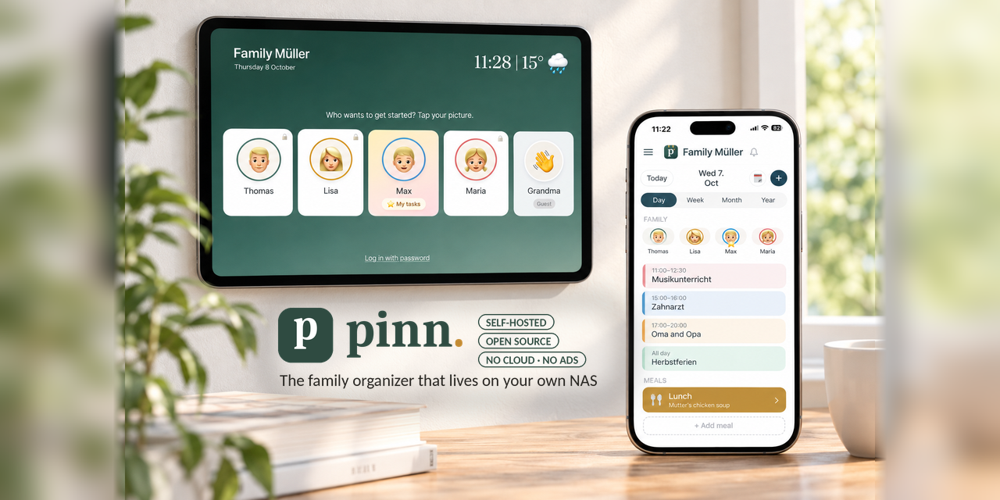
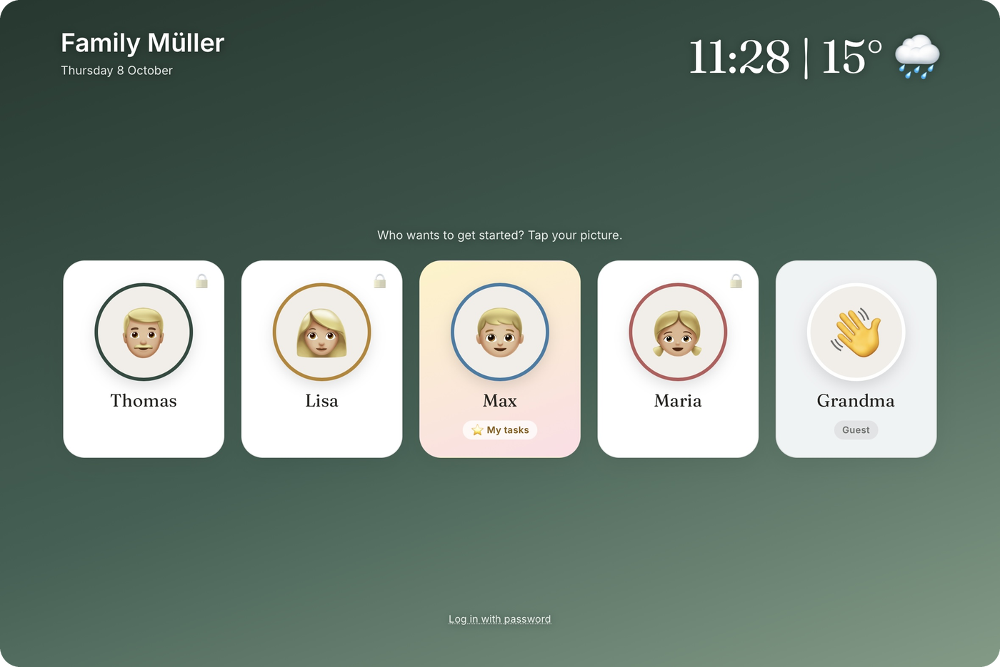
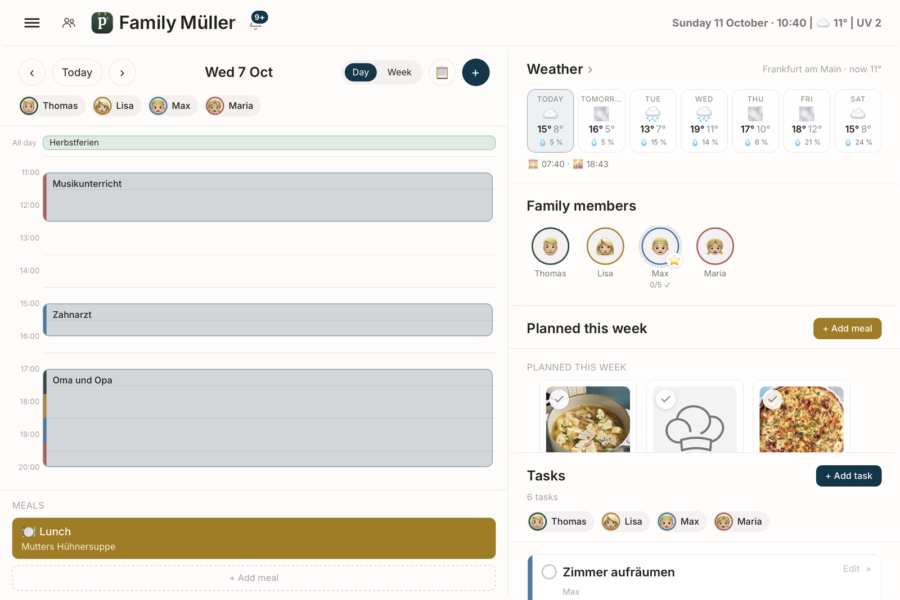
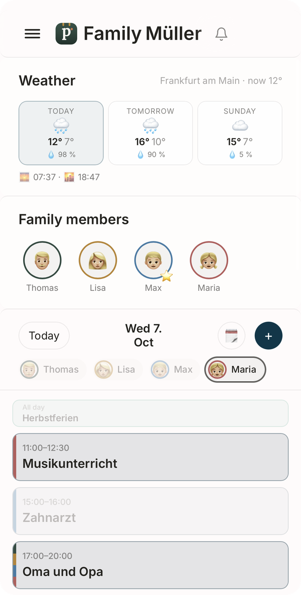
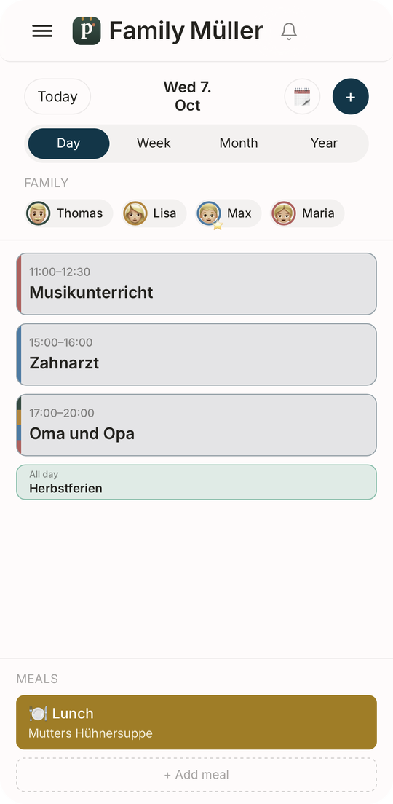
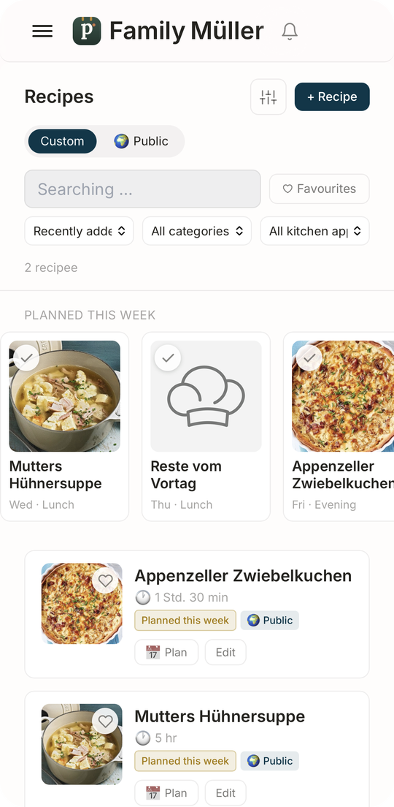
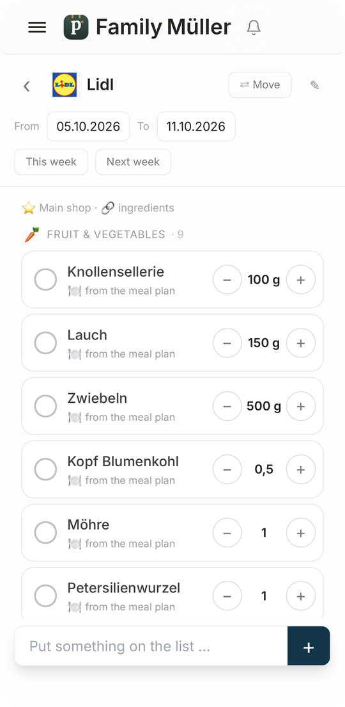
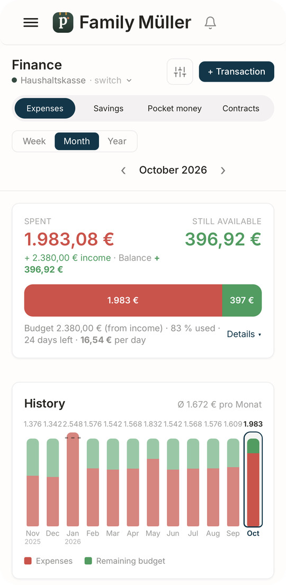
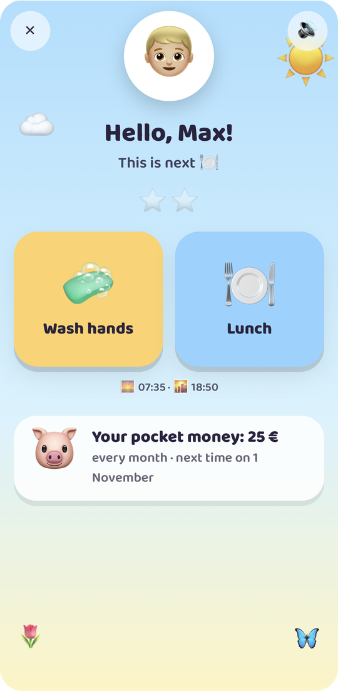
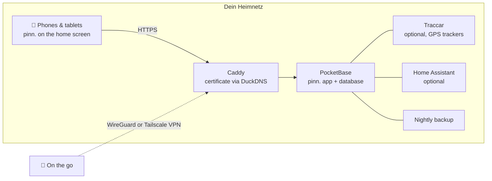

<p align="center">
  
</p>

<p align="center">
  <a href="https://github.com/pinn-shost/pinn/releases/latest"></a>
  <a href="LICENSE"></a>
  
  
  
  <a href="https://ko-fi.com/pinnapp"></a>
</p>

<p align="center">
  <a href="README.md">🇬🇧 English</a> ·
  <b>🇩🇪 Deutsch</b> ·
  <a href="README.es.md">🇪🇸 Español</a> ·
  <a href="README.fr.md">🇫🇷 Français</a> ·
  <a href="README.it.md">🇮🇹 Italiano</a> ·
  <a href="README.pt.md">🇧🇷 Português</a> ·
  <a href="README.zh.md">🇨🇳 中文</a> ·
  <a href="README.ja.md">🇯🇵 日本語</a> ·
  <a href="README.ko.md">🇰🇷 한국어</a>
</p>

<p align="center">
  <a href="#screenshots">Screenshots</a> ·
  <a href="#what-pinn-does">Funktionen</a> ·
  <a href="#installation">Installation</a> ·
  <a href="#privacy">Datenschutz</a> ·
  <a href="#faq">FAQ</a>
</p>

---

pinn. ist eine App für alles, was einen Haushalt am Laufen hält: den gemeinsamen Kalender, die Mahlzeiten der Woche, die Einkaufsliste, wer den Müll rausbringt, das Taschengeld und die Versicherung, die im März gekündigt werden muss. Sie läuft auf **deinem eigenen NAS** mit Docker und lässt sich auf jedem iPhone, iPad und Android-Handy der Familie wie eine echte App installieren.

Kein Cloud-Konto. Kein Abo. Keine Werbung, kein Tracking. Die Daten deiner Familie verlassen nie dein Zuhause.

<a id="screenshots"></a>

## Screenshots

### Auf dem iPad

An die Wand gehängt oder auf den Küchentisch gelegt: Das gemeinsame iPad zeigt die ganze Familie auf einmal.

<table>
  <tr>
    <td align="center" width="50%">
      <br>
      <sub><b>Dashboard</b> – alle tippen auf ihr eigenes Bild, optional mit PIN</sub>
    </td>
    <td align="center" width="50%">
      <br>
      <sub><b>Übersicht</b> – Wetter, Termine, Aufgaben, Essen und die Familie auf einen Blick</sub>
    </td>
  </tr>
</table>

### Auf dem Handy

Immer dabei: pinn. lässt sich auf jedem iPhone und Android-Handy wie eine echte App installieren.

<table>
  <tr>
    <td align="center" width="33%"><br><sub><b>Übersicht</b> – dein Tag auf einen Blick</sub></td>
    <td align="center" width="33%"><br><sub><b>Kalender</b> – iCloud und Google in einer Ansicht</sub></td>
    <td align="center" width="33%"><br><sub><b>Essen</b> – die Woche planen, mit einem Tipp einkaufen</sub></td>
  </tr>
  <tr>
    <td align="center" width="33%"><br><sub><b>Listen</b> – Einkauf, Vorrat, Packen</sub></td>
    <td align="center" width="33%"><br><sub><b>Finanzen</b> – Budget, Sparen, Taschengeld</sub></td>
    <td align="center" width="33%"><br><sub><b>Kinder</b> – ein spielerischer Tagesablauf</sub></td>
  </tr>
</table>

<a id="what-pinn-does"></a>

## Was pinn. kann

| | |
|---|---|
| 📅 **Kalender** | iCloud- und Google-Kalender pro Person, privat oder mit der Familie geteilt. Feiertage, Schulferien, Müllabfuhrtermine und Geburtstage aus deinen Kontakten erscheinen automatisch. |
| 🍝 **Essen & Rezepte** | Plane die Woche und schicke die Zutaten direkt auf die Einkaufsliste. Importiere Rezepte aus Text, PDF, Fotos oder einem Link – wahlweise mit KI. Teile Lieblingsrezepte mit anderen Familien auf deinem Server. |
| 🛒 **Listen** | Einkaufslisten pro Geschäft, ein Vorrat, der die Liste auffüllt, wenn etwas zur Neige geht, Packlisten aus Vorlagen (Urlaub, Kliniktasche, Party) sowie Geschenk- und Wunschlisten. |
| ✅ **Aufgaben & Haushalt** | Aufgaben mit Push-Erinnerungen, Putzpläne und Mülltonnen – dazu eine Kinderseite mit animierten Routinen, die nur zeigt, was zur Tageszeit passt. |
| 💶 **Finanzen** | Gemeinsame oder private Kassen, ein Haushaltsbudget, Sparen und Depots mit ETFs und Aktien, Taschengeld, wiederkehrende Zahlungen und Verträge mit Kündigungserinnerungen. WGs können Kosten teilen und sehen, wer wem etwas schuldet. |
| 📄 **Dokumente & Fahrzeuge** | Belege und Garantien, Ausweise mit Ablauferinnerung. Autos und Fahrräder mit Prüfterminen, Reifenwechsel, Verbrauch und Gesamtkosten. |
| 🏡 **Zuhause** | Für Mieter, Eigentümer und Vermieter: Miet- oder Kaufvertrag, Darlehen, Mängel mit Fotos, Rechnungen, Renovierungsplan, Zählerstände mit Prognose, Schlüssel und Mieteinnahmen für vermietete Wohnungen, Häuser und Garagen. Garten & Pflanzen mit einem Gießplan, der weiß, wann es geregnet hat. |
| 📍 **Familie & Standort** | Teile deinen Standort direkt in pinn. – einmalig oder für eine gewählte Zeit – und im Hintergrund über die kostenlose App Traccar Client (sendet direkt an pinn., kein zusätzlicher Server). Dazu ein „Auf dem Heimweg“-Modus, ein SOS-Alarm mit Position und Notrufnummern, Notfallpässe und Ankunftsmeldungen für Orte. |
| 🎒 **Schule & Kita** | Pro Kind: Stundenplan (eintippen oder fotografieren – die KI füllt ihn aus), Bringen und Abholen, Hausaufgaben auf der Kinderseite, Elternbriefe mit Fristen, die zu Erinnerungen werden, und Schließtage direkt im Kalender. |
| 🐾 **Haustiere** | Profile für Hunde, Katzen, Kaninchen & Co. mit Fütterungszeiten zum Abhaken, Gassirunden, einem „Wer ist dran?“-Plan, Impfungen und Entwurmung mit Push-Erinnerungen, Gewichtsverlauf, Tierarzt und Notdienst, einem Heimtierblatt für den Sitter zum Teilen, einem druckbaren „Vermisst“-Plakat und einer Erinnerung ans Auffüllen des Futterautomaten. |
| 🌦️ **Wetter & Urlaub** | Tippe aufs Wetter (Kachel auf dem Handy, oben neben Datum und Uhrzeit auf iPad und Computer) und sieh 14 Tage mit Details zu jedem Tag. Packlisten mit Ziel und Datum zeigen das Urlaubswetter – Vorhersage oder typische Werte – und schlagen vor, was mitzunehmen ist. |
| 🏠 **Smart Home** | Starte Apple-Kurzbefehle oder Home-Assistant-Aktionen aus einer Aufgabe – der Saugroboter putzt die Küche, wenn der Putzdienst fällig ist, Mähroboter und Bewässerung folgen dem Gartenplan, der Futterautomat meldet, wenn er leer wird. |
| 🎙️ **Sprachsteuerung** | „Hey Siri, pinn“: auf die Einkaufsliste setzen, sie vorlesen lassen, Aufgaben anlegen und hören, was heute ansteht – auch auf Android. |
| 🔔 **Benachrichtigungen** | Persönliche Push-Nachrichten auf iPhone, iPad und Android sowie eine Glocke, die jede Änderung in der Familie sammelt. |
| 🧩 **Und mehr** | Familien-Pinnwand mit verschiebbaren Zetteln, globale Suche, Offline-Modus mit automatischem Abgleich, Dunkelmodus, iPad-Dashboard mit Profil-PINs, Gastzugang, Kindersicherung. |

pinn. spricht **🇬🇧 English, 🇩🇪 Deutsch, 🇪🇸 Español, 🇫🇷 Français, 🇮🇹 Italiano, 🇧🇷 Português, 🇨🇳 中文, 🇯🇵 日本語 und 🇰🇷 한국어**, passt Währung und Notrufnummern an deine Region an und wechselt zwischen den Begriffen **Familie** und **WG**. Ein Server kann mehrere Familien beherbergen, jede mit eigenen Admins.

## Neu in 1.118.0

**Fahrenheit und Übersetzungs-Feinschliff**

- **Temperatur in °F oder °C:** Unter Einstellungen → Sprache & Region gibt es die neue Einstellung **Temperatur**. *Automatisch* richtet sich nach dem Land (USA: °F, sonst °C); Celsius oder Fahrenheit lassen sich auch von Hand wählen. Gilt für Wetter-Kachel, Kopfzeile, Wetter-Ansicht, Urlaubswetter, Wochenvorschau und Garten-Tipps.
- **Übersicht:** Kündigungsfristen lassen sich jetzt wie Geburtstage wegwischen; zurückholen unter Einstellungen → Übersicht.
- **Übersetzungen:** Kacheln Wetter, Geburtstage („wird 30“) und Kündigungsfristen („1 steht an“), Depot („eingezahlt“, „entnommen“, importierte Käufe und Verkäufe), Reifen-Aufgaben (Lagerort, „Aus pinn. → Fahrzeuge“), „Zugewiesen:“ in Termin-Notizen, Urlaubswetter der Packliste und Aufgaben in der Wochenvorschau. Wochen- und Monatsausblick gibt es jetzt auch auf Japanisch und Koreanisch.
- Geändert: `index.html`, `js/region.js`, `js/sprache.js`, `js/design.js`, `js/wetterkachel.js`, `js/geburtstage.js`, `js/uebersicht.js`, `js/uebersichteinstellungen.js`, `js/vertraege.js`, `js/sparen.js`, `js/finanzen.js`, `js/familie.js`, `js/ausblick.js`, `js/zuhause.js`, `js/fahrzeuge.js`, `js/mitglieder.js`, `js/aufgaben.js`, `js/termindetails.js`, `js/grundlagen.js`, `js/profilauswahl.js`, `js/sprachen.js`, `js/versionslog.js`, alle Sprachdateien in `i18n/` und `lang/` – am Server ändert sich nichts. Installation wie gewohnt (`sudo sh pinn-*/pinn-setup.sh` oder Update-Knopf).

## Neu in 1.117.0

**Text-Schlüssel, Teil 9: die Glocke und die Push-Nachrichten des Servers**

- Die **Glocke** (Heimweg, offene Einkäufe, Neuigkeiten der Familie, der leere Hinweis) und der Hinweis **„Gehst du einkaufen?“** holen ihre Texte jetzt aus den Sprachdateien in `pb_public/i18n/` – in allen neun Sprachen und als WG. „Gehst du einkaufen?“ gibt es damit auch auf Japanisch und Koreanisch.
- **Push-Nachrichten vom Server:** Die Übersetzungen stehen nicht mehr im Server-Code. Der Server liest dieselben Sprachdateien wie die App (Schlüssel `push.…`) über `pinn-textkern.js` – Einzahl, Mehrzahl und die WG-Begriffe funktionieren genau wie in der App.
- Kleinigkeiten: Auf Englisch heißt es jetzt „Fit winter tyres“ statt „Fit Winter tyres“ (ebenso bei Sommerreifen und in den anderen Sprachen); Datum und Uhrzeit in der Glocke folgen der eingestellten Sprache; Zahlen wie „1 Artikel“ stehen in richtiger Einzahl oder Mehrzahl; doppelte Anführungszeichen in japanischen Hinweisen sind weg.
- Als Nächstes: 1.118.0 räumt auf – der alte Übersetzer und `lang/` fallen weg.
- Geändert: `index.html`, `js/hinweise.js`, `js/fahrzeuge.js`, `js/sprachen.js`, `js/versionslog.js`, alle Sprachdateien in `i18n/` und `lang/` sowie am Server `pb_hooks/pinn-pushtext.js`. Einspielen wie gewohnt (`sudo sh pinn-*/pinn-setup.sh` oder Update-Knopf).

## Neu in 1.116.1

**Text-Schlüssel, Teil 8: Zuhause, Fahrzeuge und Dokumente**

- **Zuhause** (Übersicht mit der bewegten Szene, Mängel samt Mängelanzeige an den Vermieter, Kosten und Sanierung, Zähler mit Prognose und KI-Ablesung, Wartung, Garten & Pflanzen, Schlüssel und die Smarthome-Meldungen), **Fahrzeuge** (Liste, Details, Bilanz, Rechner, Fristen und automatische Aufgaben), **Dokumente** und der **Rezept-Import** aus PDF, Foto und KI holen ihre Texte jetzt aus den Sprachdateien in `pb_public/i18n/` – in allen neun Sprachen und als WG. In der Bedienung ändert sich nichts.
- Neue Einträge in deiner Sprache: Wartungs- und Pflanzenvorlagen, Gartenkalender, Dokumenttitel und die Aufgaben für HU, Inspektion und Reifenwechsel entstehen in der gerade eingestellten Sprache. Gespeicherte Einträge bleiben, wie sie sind.
- Kleinigkeiten: Mängelanzeige, Wetter-Tipps für Pflanzen, Fahrzeug-Rechner und Fristen sind in jeder Sprache ganze Sätze; Monatsnamen folgen der eingestellten Sprache; Zahlen wie „1 Tag“ oder „2 Zutaten“ stehen in richtiger Einzahl oder Mehrzahl.
- Als Nächstes: die Glocke und die Push-Texte des Servers folgen mit 1.117.0.
- Geändert: nur App-Dateien (`index.html`, `js/zuhause.js`, `js/fahrzeuge.js`, `js/dokumente.js`, `js/pdflesen.js`, `js/sprachen.js`, `js/versionslog.js`, alle Sprachdateien in `i18n/` und `lang/`) – am Server ändert sich nichts. Installation wie gewohnt (`sudo sh pinn-*/pinn-setup.sh` oder Update-Knopf).

## Neu in 1.116.0

**Text-Schlüssel, Teil 7: Familie, Ortung und Kinderseite**

- Die Seite **Familie** (Übersicht, Notfallpässe, Ortung mit *Mein Standort*, Orten und der Anleitung für *Traccar Client*, SOS und Heimweg, Schule & Kita, Haustiere und Urlaubswetter), die **Kinderseite** mit Sternen und Belohnungen, die Kachel *Familienmitglieder*, *Wo bist du?* und das Mitglied-Popup holen ihre Texte jetzt aus den Sprachdateien in `pb_public/i18n/` – in allen neun Sprachen und als WG. An der Bedienung ändert sich nichts.
- Neue Einträge in der eingestellten Sprache: Vorschläge für Kinder-Aufgaben, Schulfächer und die Packliste *Urlaub mit …* für Haustiere entstehen in der Sprache, die gerade eingestellt ist.
- Kleinigkeiten: Rund 150 Texte, die in den anderen Sprachen bisher deutsch blieben, sind jetzt übersetzt (z. B. *Dauerhaft senden*, die Anleitung für *Traccar Client*, der SOS-Countdown); Datum und Uhrzeit stehen im Format der eingestellten Sprache; Alter, Minuten und Tage in richtiger Einzahl und Mehrzahl.
- Als Nächstes: Zuhause, Fahrzeuge und Dokumente folgen mit 1.116.1.
- Geändert: nur App-Dateien (`index.html`, `js/familie.js`, `js/familienkachel.js`, `js/kinderseite.js`, `js/kinderroutine.js`, `js/sterne.js`, `js/wobistdu.js`, `js/mitglied.js`, `js/mitglieder.js`, `js/geburtstagsfeier.js`, `js/sprachen.js`, `js/versionslog.js`, alle Sprachdateien in `i18n/` und `lang/`) – am Server ändert sich nichts. Einspielen wie gewohnt (`sudo sh pinn-*/pinn-setup.sh` oder Update-Knopf).

## So funktioniert’s


```mermaid
flowchart LR
  subgraph Home["Dein Heimnetz"]
    direction LR
    P["📱 Phones & tablets<br/>pinn. on the home screen"] -->|HTTPS| C["Caddy<br/>certificate via DuckDNS"]
    C --> PB["PocketBase<br/>pinn. app + database"]
    PB --- T["Traccar<br/>optional, GPS trackers"]
    PB --- HA["Home Assistant<br/>optional"]
    PB --- B["Nightly backup"]
  end
  R["📱 On the go"] -.->|"WireGuard or Tailscale VPN"| C
```

Alles läuft als Docker-Container auf einem Gerät. HTTPS funktioniert **ohne Portfreigabe** – das Zertifikat wird per DNS-Prüfung ausgestellt. Von außen ist pinn. nur über dein eigenes VPN erreichbar.

## Voraussetzungen

- Ein NAS oder Server mit **Docker** und **Docker Compose 2.17+** – entwickelt auf einem UGREEN NAS mit UGOS, läuft auf jedem Linux-Docker-Host (amd64, arm64, armv7)
- SSH-Zugang dazu
- Optional, aber empfohlen: eine kostenlose [DuckDNS](https://www.duckdns.org)-Subdomain für HTTPS – nötig für Push-Benachrichtigungen und die Installation von pinn. als App

<a id="installation"></a>

## Installation

1. Lade das ZIP des [neuesten Releases](https://github.com/pinn-shost/pinn/releases/latest) herunter und entpacke es.
2. Lege auf dem NAS einen Ordner an, z. B. `/volume1/docker/Pocketbase`, und kopiere den entpackten Ordner (z. B. `pinn-1.118.0` oder `pinn-main`) unverändert hinein.
3. Melde dich per SSH an und führe aus:
   ```sh
   cd /volume1/docker/Pocketbase && sudo sh pinn-*/pinn-setup.sh
   ```
   Das Skript kopiert jede Datei an ihren Platz, lädt die Bibliotheken für PDF-Import und Texterkennung in Fotos herunter und startet pinn.
4. Öffne `http://<NAS-IP>:8090` → **Als Hauptadmin anmelden** → Passwort `Admin` → wähle dein eigenes Passwort.
5. Der **Einrichtungsassistent** führt dich durch den Rest – HTTPS, Fernzugriff über WireGuard oder Tailscale, Google, KI, Standort und Home Assistant – Schritt für Schritt, in neun Sprachen.
6. Öffne pinn. auf jedem Handy über die HTTPS-Adresse und füge es zum Home-Bildschirm hinzu:
   - **iPhone/iPad (Safari):** Teilen → *Zum Home-Bildschirm* (für Benachrichtigungen iOS 16.4 oder neuer)
   - **Android (Chrome):** Einstellungen → Benachrichtigungen → *pinn. als App installieren* oder Chrome-Menü ⋮ → *App installieren*

   Schalte dann auf jedem Gerät unter **Einstellungen → Benachrichtigungen → Auf diesem Gerät aktivieren** die Benachrichtigungen ein.

**Aktualisieren:** Lade das neue ZIP herunter, lege den entpackten Ordner in denselben Ordner und führe `sudo sh pinn-*/pinn-setup.sh` erneut aus. Ersetzte Dateien bleiben in `_alt/` erhalten, deine Daten bleiben unberührt.

**Sicherungen** laufen jede Nacht in `./backups` und werden 14 Tage aufbewahrt.

<a id="privacy"></a>

## Datenschutz

pinn. wurde für Daten gebaut, die du nie einem Cloud-Dienst geben würdest: Kontoauszüge, Gesundheitsunterlagen, wo sich deine Kinder aufhalten. Deshalb:

- **Alle Daten liegen auf deinem NAS** in einer einzigen PocketBase-Datenbank. Es gibt keinen pinn.-Server und keine Telemetrie.
- **Keine Skripte von fremden Servern.** Aller Code und alle Bibliotheken kommen von deinem NAS.
- **Push-Nachrichten enthalten keine Inhalte.** Apple, Google und Mozilla liefern nur ein leeres Wecksignal; das Gerät holt die Nachricht dann von deinem NAS.
- **Passwörter für iCloud und Google** werden verschlüsselt in einer gesperrten Sammlung gespeichert.
- **Nicht aus dem Internet erreichbar.** Der Fernzugriff läuft über dein eigenes VPN.

pinn. kontaktiert externe Dienste nur für Funktionen, die sie brauchen:

| Dienst | Wofür | Wann |
|---|---|---|
| [Open-Meteo](https://open-meteo.com) | Wettervorhersage | wenn eine Heimadresse gesetzt ist |
| [OpenStreetMap Nominatim](https://nominatim.openstreetmap.org) | Adressen in Kartenpositionen umwandeln | beim Eingeben von Adressen |
| [OpenStreetMap-Kacheln](https://www.openstreetmap.org) | Kartenhintergrund | auf der Standortseite, über dein NAS geladen |
| [Google Fonts](https://fonts.google.com) | Schriftarten | beim Laden der App |
| [OpenHolidays API](https://www.openholidaysapi.org) | Feiertage und Schulferien | wenn eine Heimadresse gesetzt ist |
| [DuckDNS](https://www.duckdns.org) | HTTPS-Zertifikat und Adresse | falls eingerichtet |
| iCloud / Google | Kalender und Kontakte | nur für Konten, die du verbindest |
| Google Gemini | Rezepte und Dokumente einlesen | nur wenn du einen API-Schlüssel hinzufügst |
| jsDelivr | einmaliger Download von pdf.js und Tesseract | nur bei der Installation |

<a id="faq"></a>

## FAQ

<details>
<summary><b>Muss ich Ports an meinem Router öffnen?</b></summary>
<br>
Nein. Das HTTPS-Zertifikat wird per DNS-Prüfung ausgestellt, und der Fernzugriff läuft über ein VPN – WireGuard auf einer FRITZ!Box oder Tailscale für jeden anderen Router.
</details>

<details>
<summary><b>Funktioniert es ohne NAS?</b></summary>
<br>
Jedes dauerhaft laufende Gerät mit Docker funktioniert: ein Mini-PC, ein Raspberry Pi 4/5 oder ein Linux-Server.
</details>

<details>
<summary><b>Ist pinn. eine „echte“ App aus dem App Store?</b></summary>
<br>
pinn. ist eine Web-App, die du zum Home-Bildschirm hinzufügst. Sie öffnet sich dann im Vollbild wie eine native App, funktioniert offline, zeigt ein Abzeichen mit offenen Aufgaben und empfängt Push-Nachrichten – ganz ohne App Store.
</details>

<details>
<summary><b>Können mehrere Familien eine Installation nutzen?</b></summary>
<br>
Ja. Der Hauptadmin legt Familien an, jede Familie bekommt eigene Admins, Kalender und Daten. Rezepte lassen sich optional zwischen Familien teilen.
</details>

<details>
<summary><b>Und die Kinder?</b></summary>
<br>
Profile mit Kindersicherung sehen nur ihre eigenen Aufgaben und können nichts löschen oder ändern. Finanzen, Dokumente und Fahrzeuge bleiben verborgen. Kleinere Kinder bekommen eine eigene spielerische Seite mit Tagesroutinen.
</details>

<details>
<summary><b>Was kostet es?</b></summary>
<br>
Nichts – pinn. ist kostenlos und Open Source unter der MIT-Lizenz. Optionale Dienste wie die Gemini-KI haben kostenlose Kontingente.
</details>

## Aufbau des Repositorys

Das Repository hat denselben Aufbau wie eine Installation auf dem NAS – jede Datei liegt dort, wo sie am Ende landet:

```
pinn/
├── pb_hooks/            server: *.pb.js hooks and their helper modules (pinn-*.js, calendar-sync.js)
├── pb_public/           web app served by PocketBase
│   ├── index.html       the app page, built from src/ (HTML, start check) – do not edit by hand
│   ├── js/              app code split out of index.html, plain <script> files without a build step
│   │                    (ruhemodus.js, textkern.js, sprachen.js, region.js, grundlagen.js, popups.js, verbindung.js, benutzer.js, mitteilungen.js, serverzugriff.js, tastatur.js, anmeldemaske.js, dashboard.js, dashboardhintergrund.js, profilauswahl.js, pineingabe.js, dashboardsitzung.js, dashboardkonto.js, familienverwalten.js, einrichten.js, exportieren.js, hauptadminseite.js, anmeldung.js, konto.js, profilverwaltung.js, zustand.js, bedienzustand.js, rezeptbilder.js, zusammenfuehren.js, speichern.js, design.js, sprache.js, uebersicht.js, familienkachel.js, wobistdu.js, geburtstagsfeier.js, wetterkachel.js, geburtstage.js, uebersichteinstellungen.js, familiensync.js, bereiche.js, kalenderquellen.js, icsparser.js, zeitleiste.js, termindetails.js, kalenderdatei.js, wetter.js, wohnort.js, feiertage.js, muellkalender.js, mitglieder.js, profilbild.js, mitglied.js, kinderseite.js, kinderroutine.js, sterne.js, kalenderansicht.js, essenplanen.js, rezeptparser.js, rezeptdialog.js, rezeptbild.js, rezeptmengen.js, einkauf.js, einkaufslisten.js, einkaufseingabe.js, rezepte.js, offline.js, aufgabenextras.js, appbadge.js, reisen.js, aufgabendaten.js, haushalt.js, reihum.js, aufgaben.js, smarthome.js, sprachsteuerung.js, termine.js, ansichten.js, versionspruefung.js, sicherungen.js, geraete.js, fehlerprotokoll.js, versionslog.js, einstellungen.js, kalenderkonto.js, finanzen.js, kassen.js, vorrat.js, vorrat2.js, sparen.js, vertraege.js, fahrzeuge.js, zuhause.js, dokumente.js, pdflesen.js, appstart.js, pinnwand.js, listen.js, familie.js, hinweise.js, ausblick.js – ausblick.js always comes last)
│   ├── css/             app styles split out of index.html, plain CSS without a build step (ergaenzung.css, energiesparen.css, basis.css … haustierewetter.css, terminal.css, glocke.css)
│   ├── einrichtung.js   setup assistant · datenexport.js  data export
│   ├── i18n/            texts by key (de, en, fr, es, it, pt, zh, ja, ko) – English is the reference
│   ├── lang/            old dictionaries for parts without keys yet (en, fr, es, it, pt, zh, ja, ko)
│   └── vendor/          pinn.css, pocketbase/ (pdf.js and Tesseract are downloaded by the setup)
├── .github/             GitHub Actions (workflows/check.yml), checks (scripts/), CONTRIBUTING.md, SECURITY.md, images – not installed
├── src/                 sources of index.html (build.js, rahmen.html, teile/) – not installed
├── caddy/Caddyfile      HTTPS reverse proxy
├── docker-compose.yaml  all containers
├── env.txt              template for .env
├── pinn-setup.sh        install & update
├── pinn-wartung.sh      backups & updates (container "wartung")
├── pinn-pocketbase-update.sh
├── index.html           placeholder only, never installed (keeps the update button of 1.38 working)
└── README.md            this page · README.<code>.md in de, es, fr, it, pt, zh, ja, ko
```

`pinn-setup.sh` kopiert `pb_hooks/`, `pb_public/` und `caddy/Caddyfile` 1:1 in den Projektordner; Datenordner (`pb_data/`, `konfig/`, `backups/`, `caddy/data/` …) werden nie angerührt.

## Mitmachen

Fehlerberichte, Ideen und Übersetzungen sind herzlich willkommen – siehe [CONTRIBUTING.md](.github/CONTRIBUTING.md). Bitte melde Sicherheitslücken privat, wie in [SECURITY.md](.github/SECURITY.md) beschrieben. Führe vor einem Pull Request bitte `node .github/scripts/check-all.js` aus – dieselben Prüfungen laufen automatisch auf GitHub.

## pinn. unterstützen

pinn. ist kostenlos und bleibt es – komplett, für alle. Es entsteht in meiner Freizeit. Wenn es dir den Alltag ein wenig erleichtert, freue ich mich über einen kleinen Beitrag, ganz freiwillig:

<p>
  <a href="https://ko-fi.com/pinnapp"></a>
  <a href="https://buymeacoffee.com/pinn"></a>
</p>

Ein ⭐ hilft auch – damit finden andere Familien pinn. leichter.

## Gebaut mit

[PocketBase](https://pocketbase.io) (MIT) · [Tailwind CSS](https://tailwindcss.com) (MIT) · [pdf.js](https://mozilla.github.io/pdf.js/) (Apache-2.0) · [Tesseract.js](https://tesseract.projectnaptha.com) (Apache-2.0) · [Traccar](https://www.traccar.org) (Apache-2.0) · [Caddy](https://caddyserver.com) (Apache-2.0)

## Lizenz

[MIT](LICENSE) – nutze es, ändere es, teile es.
