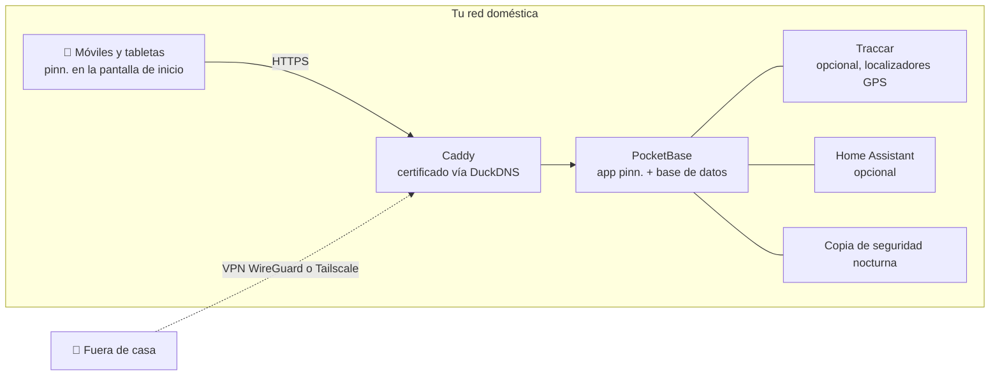

<p align="center">
  
</p>

<p align="center">
  <a href="https://github.com/pinn-shost/pinn/releases/latest"></a>
  <a href="LICENSE"></a>
  
  
  
  <a href="https://ko-fi.com/pinnapp"></a>
</p>

<p align="center">
  <a href="README.md">🇬🇧 English</a> ·
  <a href="README.de.md">🇩🇪 Deutsch</a> ·
  <b>🇪🇸 Español</b> ·
  <a href="README.fr.md">🇫🇷 Français</a> ·
  <a href="README.it.md">🇮🇹 Italiano</a> ·
  <a href="README.pt.md">🇧🇷 Português</a> ·
  <a href="README.zh.md">🇨🇳 中文</a> ·
  <a href="README.ja.md">🇯🇵 日本語</a> ·
  <a href="README.ko.md">🇰🇷 한국어</a> ·
  <a href="README.ru.md">🇷🇺 Русский</a> ·
  <a href="README.nl.md">🇳🇱 Nederlands</a> ·
  <a href="README.tr.md">🇹🇷 Türkçe</a> ·
  <a href="README.pl.md">🇵🇱 Polski</a> ·
  <a href="README.uk.md">🇺🇦 Українська</a>
</p>

<p align="center">
  <a href="#capturas-de-pantalla">Capturas</a> ·
  <a href="#qué-hace-pinn">Funciones</a> ·
  <a href="#instalación">Instalación</a> ·
  <a href="#privacidad">Privacidad</a> ·
  <a href="#preguntas-frecuentes">Preguntas frecuentes</a>
</p>

---

pinn. es una sola app para todo lo que hace funcionar un hogar: el calendario compartido, las comidas de la semana, la lista de la compra, a quién le toca sacar la basura, la paga de los niños y el seguro que hay que cancelar en marzo. Funciona en **tu propio NAS** con Docker y se instala como una app nativa en cada iPhone, iPad y móvil Android de la familia.

Sin cuenta en la nube. Sin suscripción. Sin anuncios ni rastreo. Los datos de tu familia nunca salen de casa.

## Capturas de pantalla

### En el iPad

Colgado en la pared o sobre la mesa de la cocina: el iPad compartido muestra a toda la familia de un vistazo.

<table>
  <tr>
    <td align="center" width="50%">
      <a href=".github/assets/screenshots/dashboard.png"></a><br>
      <sub><b>Panel</b> – cada uno toca su propia foto, con PIN opcional</sub>
    </td>
    <td align="center" width="50%">
      <a href=".github/assets/screenshots/ipad-overview.png"></a><br>
      <sub><b>Resumen</b> – tiempo, citas, tareas, comidas y la familia de un vistazo</sub>
    </td>
  </tr>
</table>

### En el móvil

Siempre contigo: pinn. se instala en cada iPhone y móvil Android como una app nativa.

<table>
  <tr>
    <td align="center" width="33%"><a href=".github/assets/screenshots/home.png"></a><br><sub><b>Resumen</b> – tu día de un vistazo</sub></td>
    <td align="center" width="33%"><a href=".github/assets/screenshots/calendar.png"></a><br><sub><b>Calendario</b> – iCloud y Google en una sola vista</sub></td>
    <td align="center" width="33%"><a href=".github/assets/screenshots/meals.png"></a><br><sub><b>Comidas</b> – planifica la semana, compra con un toque</sub></td>
  </tr>
  <tr>
    <td align="center" width="33%"><a href=".github/assets/screenshots/lists.png"></a><br><sub><b>Listas</b> – compra, despensa, equipaje</sub></td>
    <td align="center" width="33%"><a href=".github/assets/screenshots/finance.png"></a><br><sub><b>Finanzas</b> – presupuesto, ahorro, paga</sub></td>
    <td align="center" width="33%"><a href=".github/assets/screenshots/chat.png"></a><br><sub><b>Chat</b> – cifrado de extremo a extremo, con mensajes de voz y ubicación</sub></td>
  </tr>
</table>

### Más pantallas

Pulsa cualquier imagen para verla en tamaño completo.

<details>
<summary><b>Mostrar más capturas</b></summary>

<br>

<table>
  <tr>
    <td align="center" width="25%"><a href=".github/assets/screenshots/house.png"></a><br><sub><b>Hogar</b> – casa, costes, préstamo, defectos y contadores en un solo lugar</sub></td>
    <td align="center" width="25%"><a href=".github/assets/screenshots/tasks.png"></a><br><sub><b>Tareas</b> – recordatorios automáticos, p. ej. ITV y cambio de neumáticos, con botón directo</sub></td>
    <td align="center" width="25%"><a href=".github/assets/screenshots/vehicles.png"></a><br><sub><b>Vehículos</b> – ITV, neumáticos, repostaje y carga</sub></td>
    <td align="center" width="25%"><a href=".github/assets/screenshots/scan_pantry.png"></a><br><sub><b>Escanear la despensa</b> – escanea el código de barras, guarda o consume</sub></td>
  </tr>
  <tr>
    <td align="center" width="25%"><a href=".github/assets/screenshots/weekly_summary_1.png"></a><br><sub><b>Vista semanal</b> – el tiempo y lo que sigue pendiente</sub></td>
    <td align="center" width="25%"><a href=".github/assets/screenshots/weekly_summary_2.png"></a><br><sub><b>Vista semanal</b> – día a día: limpieza, basura, pagos</sub></td>
    <td align="center" width="25%"><a href=".github/assets/screenshots/weekly_summary_3.png"></a><br><sub><b>La semana pasada en breve</b> – citas, comidas, gastos – y accesos directos</sub></td>
    <td align="center" width="25%"><a href=".github/assets/screenshots/kids.png"></a><br><sub><b>Niños</b> – una rutina diaria divertida</sub></td>
  </tr>
</table>

</details>

<sub>📁 <a href=".github/assets/screenshots">Todas las imágenes en una carpeta</a></sub>

## Qué hace pinn.

| | |
|---|---|
| 📅 **Calendario** | Calendarios de iCloud y Google por persona, privados o compartidos con la familia. Festivos, vacaciones escolares, días de recogida de basura y cumpleaños de tus contactos aparecen automáticamente. |
| 🍝 **Comidas y recetas** | Planifica la semana y manda los ingredientes directamente a la lista de la compra. Importa recetas desde texto, PDF, fotos o un enlace – opcionalmente con IA. Comparte tus recetas favoritas con otras familias de tu servidor. |
| 🛒 **Listas** | Listas de la compra por tienda, una despensa que rellena la lista cuando algo se acaba, listas de equipaje a partir de plantillas (vacaciones, bolsa del hospital, fiesta), listas de regalos y de deseos con un planificador «quién regala qué» que quien recibe nunca ve. |
| ✅ **Tareas y hogar** | Tareas con recordatorios push, planes de limpieza y cubos de basura – y una página infantil con rutinas animadas que solo muestra lo que toca a esa hora del día. |
| 💶 **Finanzas** | Cajas compartidas o privadas, presupuesto del hogar, ahorro y depósitos con ETF y acciones, paga, pagos periódicos y contratos con recordatorio de cancelación. Los pisos compartidos reparten gastos y ven quién debe a quién. |
| 📄 **Documentos y vehículos** | Tiques y garantías, documentos de identidad con aviso de caducidad. Coches y bicis con fechas de ITV, cambio de neumáticos, consumo y coste total. |
| 🏡 **Casa** | Para inquilinos, propietarios y arrendadores: contrato de alquiler o de compra, préstamo, desperfectos con fotos, tiques, plan de reformas, lecturas de contadores con previsión, llaves e ingresos de alquiler de pisos, casas y garajes alquilados. Jardín y plantas con un plan de riego que sabe cuándo ha llovido. |
| 📍 **Familia y ubicación** | Comparte tu ubicación directamente desde pinn. – una vez o durante un tiempo elegido – y en segundo plano con la app gratuita Traccar Client (envía directamente a pinn., sin servidor adicional). Además, un modo «de camino a casa», una alerta SOS con posición y números de emergencia, fichas de emergencia y avisos de llegada a lugares. |
| 🎒 **Colegio y guardería** | Por niño: horario (escríbelo o hazle una foto – la IA lo rellena), llevar y recoger, deberes en la página infantil, circulares con plazos que se convierten en recordatorios y días de cierre directamente en el calendario. |
| 🐾 **Mascotas** | Perfiles para perros, gatos, conejos y demás, con horas de comida para marcar, paseos, turnos de «a quién le toca», vacunas y desparasitaciones con recordatorio push, gráfica de peso, veterinario y urgencias veterinarias, una ficha para cuidadores para compartir y un cartel imprimible de «se busca» y un aviso para rellenar el comedero automático. |
| 🌦️ **Tiempo y vacaciones** | Toca el tiempo (una tarjeta en el móvil, arriba junto a la fecha y la hora en iPad y ordenador) para ver 14 días con detalles de cada día. Las listas de equipaje con destino y fechas muestran el tiempo de las vacaciones – previsión o valores típicos – y sugieren qué llevar. |
| 🏠 **Casa inteligente** | Lanza Atajos de Apple o acciones de Home Assistant desde una tarea – el robot aspirador limpia la cocina cuando toca la tarea, el robot cortacésped y el riego siguen el plan del jardín y el comedero avisa cuando se vacía. |
| 🎙️ **Control por voz** | «Oye Siri, pinn»: añade a la lista de la compra, que te la lea, crea tareas y escucha lo que hay hoy – también en Android. |
| 💬 **Chat** | Chat familiar y privado con cifrado de extremo a extremo, push, marcas de lectura y respuestas. |
| 🔔 **Notificaciones** | Mensajes push personales en iPhone, iPad y Android, y una campana que recoge todos los cambios de la familia. |
| 🧩 **Todo lo demás** | Tablón familiar con notas movibles, búsqueda global, modo sin conexión con sincronización automática, modo oscuro, panel para iPad con PIN por perfil, cuenta de invitado, control parental. |

pinn. habla **🇬🇧 English, 🇩🇪 Deutsch, 🇪🇸 Español, 🇫🇷 Français, 🇮🇹 Italiano, 🇧🇷 Português, 🇨🇳 中文, 🇯🇵 日本語, 🇰🇷 한국어, 🇷🇺 Русский, 🇳🇱 Nederlands, 🇹🇷 Türkçe, 🇵🇱 Polski y 🇺🇦 Українська**, adapta la moneda y los números de emergencia a tu región y cambia entre los términos **familia** y **piso compartido**. Un servidor puede alojar varias familias, cada una con sus propios administradores.

## Novedades de la 1.154.0

**Corrección de seguridad en las direcciones del calendario**

- Corregido: ahora se comprueban las direcciones del calendario. Cuando se borra, cambia o lee un evento en iCloud o Google, el servidor usa los datos de acceso del calendario familiar y solo puede enviarlos a los servidores de Apple y Google. Antes, un perfil con sesión iniciada podía enviar esos datos a cualquier otro servidor con una petición manipulada. Los calendarios que ya funcionan no se ven afectados.
- Cambiado: `pb_hooks/calendar-sync.js`, `js/versionslog.js`, `js/sprachen.js`, `i18n/versionslog.en.js`, `src/`, `index.html`, README.

## Novedades de la 1.153.2

**Claves de Gemini con «AQ.», textos de estado, registro de errores**

- Corregido: el asistente de configuración acepta las nuevas claves de Google Gemini que empiezan por `AQ.` (llevan un punto). Antes, «Comprobar» decía que la clave era válida, pero «Siguiente» la rechazaba.
- Corregido: el estado de un miembro de la familia («en camino», «última vez») estaba siempre en alemán; ahora aparece en todos los idiomas.
- Cambiado: el registro de errores muestra sus mensajes en alemán para el idioma alemán y en inglés para todos los demás.
- Cambiado: `pb_hooks/pinn-einrichtung.js`, `pb_hooks/pinn-protokoll.js`, `pb_hooks/protokoll.pb.js`, `einrichtung.js`, `js/fehlerprotokoll.js`, `js/familie.js`, `js/familienkachel.js`, `js/versionslog.js`, `js/sprachen.js`, `i18n/`, `src/`, `index.html`, README.

## Novedades de la 1.153.1

**Salud: cinco bloques nuevos, «Yo» en tu propio perfil**

- Nuevo en la página de salud: **protector solar** (índice UV de hoy en casa, aviso solo en días de sol), **sueño** (aviso antes de dormir, por la mañana «¿Qué tal has dormido?»), **fruta y verdura** (raciones al día), **revisión de garrapatas** (abril–octubre) y **revisiones** (dentista, chequeo … con intervalo; para niños los exámenes U alemanes por edad). En los niños, los avisos también llegan a los padres.
- Nuevo: en tu propio perfil pinn. muestra «Yo» en vez de tu nombre – filtro del calendario, tareas, familia y en todas partes, adaptado dentro de las frases. Además: icono de línea para la flecha de restaurar, nuevo icono de llanta, el mismo dorado para avisos amarillos en modo oscuro.
- Cambiado: `pb_hooks/pinn-gesundheit.js`, `js/gesundheit.js`, `css/gesundheit.css`, `js/mitglieder.js`, `js/symbole.js`, `css/dunkelfarbe.css`, `js/aufgaben.js`, `js/termine.js`, `js/listen.js`, `js/sparen.js`, `js/vertraege.js`, `js/familie.js`, `js/hinweise.js`, `js/kassen.js`, `js/zuhause.js`, `js/dokumente.js`, `js/fahrzeuge.js`, `js/ausblick.js`, `js/sterne.js`, `js/vorrat2.js`, `i18n/`, `js/sprachen.js`, `js/versionslog.js`, `index.html`.

## Novedades de la 1.153.0

**Seguridad desde Home Assistant**

- Nuevo: **Seguridad** – los admins de la familia agrupan dispositivos de Home Assistant en Ajustes → Seguridad: ventanas y puertas, cerraduras, cámaras, puerta de garaje y persianas, detectores de humo y agua, alarma, detectores de movimiento. El panel familiar muestra una barra abajo (p. ej. «Todo cerrado», «Ventana cocina está abierto», «1 cámara está encendida», en rojo si hay alarma) y la vista general recibe el mosaico «Seguridad», donde los adultos pueden cerrar con llave una cerradura abierta (nunca abrirla). **Revisión nocturna** opcional: a la hora elegida, todos los admins reciben un aviso si algo sigue abierto, sin llave o con la alarma desactivada. Requisito: Home Assistant conectado en Ajustes → Hogar inteligente.
- Corregido: en modo oscuro, los botones bajo el título de una tarea (inicio de hogar inteligente, lectura de contadores …) eran azul sobre azul; ahora son dorados.
- Cambiado: `pb_hooks/pinn-sicherheit.js` (new), `pb_hooks/sicherheit.pb.js` (new), `pb_hooks/pinn-smarthome.js`, `pb_hooks/pinn-schema.js`, `js/sicherheit.js` (new), `css/sicherheit.css` (new), `js/uebersicht.js`, `js/profilauswahl.js`, `js/einstellungen.js`, `css/dunkelfarbe.css`, `i18n/`, `js/sprachen.js`, `js/versionslog.js`, `pinn-setup.sh`, `src/`, `index.html`.

## Novedades de la 1.152.1

**Restaurar copias de seguridad vuelve a funcionar**

- Corregido: restaurar una copia de seguridad (Ajustes → Sistema → Copias y actualizaciones) siempre se detenía en «Comprobar copia», tanto con solo datos como con todo. La copia del estado actual hecha justo antes limpiaba copias antiguas y sobrescribía el nombre de la copia elegida, que luego no se encontraba. Cada intento fallido dejaba una copia «Antes de una restauración»; son inofensivas y se eliminan solas (se guardan las 3 últimas). Con la actualización se renueva `pinn-wartung.sh`; el contenedor «wartung» se reinicia solo.
- Stack de Portainer: las copias de seguridad ya funcionan de verdad. El servicio «wartung» del stack no tenía nada que arrancar, porque faltaba una parte de la 1.151.0 en el repositorio. Ahora la imagen incluye el script de copias, que encuentra solo el contenedor pinn del stack: copia nocturna, «Hacer copia ahora» y «Restaurar» (datos y configuración) funcionan como en la instalación con script. Las actualizaciones siguen en Portainer. Después: en Portainer «Update the stack» con «Re-pull image and redeploy».
- Cambiado: `pinn-wartung.sh`, `docker/Dockerfile`, `.github/workflows/image.yml`, `pb_hooks/pinn-system.js`, `js/sicherungen.js`, `js/serverzugriff.js`, `i18n/`, `js/versionslog.js`, `js/sprachen.js`, `src/`, `index.html`.

## Novedades de la 1.152.0

**Tu propio proxy inverso en lugar de Tailscale**

- Novedad: acceso desde internet con tu propio proxy inverso (Nginx Proxy Manager, Traefik, Cloudflare Tunnel…); véase «Acceso desde internet con tu propio proxy inverso» en Instalación. pinn. solo cree la dirección del visitante de proxies de confianza (`PINN_PROXY_NETZE`), así el bloqueo tras contraseñas erróneas no se esquiva (IPv6: por /64). Desde internet se bloquean la administración de PocketBase y sus propias vías de inicio de sesión, la contraseña inicial `Admin` no funciona y se frena adivinar IDs de rastreadores. Ante esos intentos, los administradores reciben un aviso «🚨 Aviso de seguridad» (dirección, red de casa o internet, dispositivo); todos los detalles están en el registro de errores en «Seguridad». En la red de casa no cambia nada.
- Cambiado: `pb_hooks/pinn-netz.js` (new), `pb_hooks/netz.pb.js` (new), `pb_hooks/pinn-alarm.js` (new), `pb_hooks/pinn-sitzungen.js`, `pb_hooks/benutzer.pb.js`, `pb_hooks/dashboard.pb.js`, `pb_hooks/zuhause.pb.js`, `pb_hooks/sprache.pb.js`, `pb_hooks/smarthome.pb.js`, `pb_hooks/pinn-ortung.js`, `pb_hooks/pinn-protokoll.js`, `pb_hooks/pinn-pushtext.js`, `js/anmeldemaske.js`, `js/fehlerprotokoll.js`, `js/hinweise.js`, `js/appstart.js`, `i18n/`, `docker/docker-compose.portainer.yaml`, `env.txt`, `js/sprachen.js`, `js/versionslog.js`, `src/`, `index.html`.

## Novedades de la 1.151.0

**Stack de Portainer, imagen lista**

- Novedad: pinn. se puede instalar desde la interfaz de stacks de Portainer, sin SSH y sin el script de instalación. En cada versión se construye una imagen lista (amd64, arm64) y se publica en `ghcr.io/pinn-shost/pinn`; el nuevo archivo `docker/docker-compose.portainer.yaml` la usa con volúmenes y sin nombres de contenedor fijos (ya no choca con un contenedor Tailscale existente). El stack incluye además un servicio de copias (copia nocturna, «Copia ahora» y «Restaurar» en la app; las actualizaciones siguen en Portainer) y bloques opcionales comentados para Traccar y el desvío hacia Home Assistant. Véase «Stack de Portainer (sin script)» en Instalación.
- Cambiado: `docker/` (new), `.github/workflows/image.yml` (new), `pinn-wartung.sh`, `pb_hooks/pinn-system.js`, `js/sicherungen.js`, `i18n/`, `js/sprachen.js`, `js/versionslog.js`, `src/`, `index.html`.

## Novedades de la 1.150.11

**Iconos y pequeños arreglos**

- Icono de peine en «Peinarse» en la página infantil; ya no hay campo de emoji junto al nombre del depósito; listas desplegables de cajas sin emoji; la herramienta ahora es una llave fija; «Menús para invitados» con el icono de dos personas; tocar el logotipo junto al nombre de la familia lleva al resumen; la tarjeta Notificaciones se rellena primero para que «Activar en este dispositivo» siempre aparezca; los iconos de los atajos son grises en modo oscuro.
- Cambiado: `js/symbole.js`, `js/symbole3.js`, `js/ansichten.js`, `js/konto.js`, `css/dunkelfarbe.css`, `js/sprachen.js`, `js/versionslog.js`, `i18n/versionslog.en.js`, `src/`, `index.html`.

## Novedades de la 1.150.10

**Modo oscuro, más iconos, nuevo banner de mascotas, diario de mascotas**

- **Modo oscuro.** El texto azul ahora es dorado (dispositivos, listas, «Planificar compra», marcas en mascotas, salud y tareas); las barras de Hogar tienen el color de la habitación; los avisos del chat, de contratos y «De un vistazo» se leen bien. **Más iconos en lugar de emojis:** fotos de perfil (bebé, niño, niña, hombre, mujer, abuelo, abuela), familia y piso compartido, animales (perro, gato, conejo, hámster, pájaro, pollito, pez, caballo, tortuga, serpiente); las listas desplegables solo muestran el texto. **Nuevo banner de mascotas** con animales de colores. **Diario de mascotas:** una revisión marcada aparece en el diario y con la × se deshace una marca accidental.
- Cambiado: `css/dunkelfarbe.css` (new), `js/symbole3.js` (new), `js/symbole.js`, `js/szenen.js`, `js/familie.js`, `js/haushalt.js`, `css/symbolfarbe.css`, `css/haustierewetter.css`, `js/sprachen.js`, `js/versionslog.js`, `i18n/`, `src/`, `pinn-setup.sh`, `index.html`.

## Novedades de la 1.150.9

**Color en los iconos, iconos de vehículos y plantas**

- **Color de día.** Los iconos llevan ahora un ligero relleno (superficies blancas, sol amarillo, lluvia azul, coche rojo, herramientas grises, plantas verdes) con el mismo estilo de línea; el modo oscuro no cambia. **Iconos de vehículo:** en lugar del emoji de coche eliges un icono de línea (berlina, SUV, taxi, furgoneta, pickup, tractor, caravana, bicicleta, e-bike …). Los **iconos de plantas** también se eligen en la app, con nuevos iconos de cactus, palmera, tulipán, girasol, rosa y más. En los banners de Vehículos y Hogar los coches solo brillan de noche: amarillento delante, rojo detrás.
- Cambiado: `js/symbole2.js`, `css/symbolfarbe.css` (new), `js/symbole.js`, `js/wetterlogos.js`, `js/symbolwahl.js`, `js/fahrzeuge.js`, `js/zuhause.js`, `js/dokumente.js`, `css/fahrzeuge.css`, `js/sprachen.js`, `js/versionslog.js`, `i18n/`, `src/`, `pinn-setup.sh`, `index.html`.

## Novedades de la 1.150.8

**Iconos en todas partes, elegidos desde la app**

- **Iconos propios en todas partes.** Comida, hogar, vehículos, plantas, ropa, juguetes y deporte también tienen ahora iconos de línea propios (habitaciones, tipos de residuos, tipos de vehículo, jardín, despertador, selector de calendario, cuenta atrás). Los **iconos de categoría** en Finanzas, Contratos, Documentos y Despensa se eligen entre unos 150 iconos listos en lugar del teclado de emojis, y el mismo tipo de categoría tiene el mismo icono en todas partes. Las escenas de Hogar y Vehículos muestran vehículos nuevos y coloridos. Detalles: el tiempo «Ahora» sin borde discontinuo, tipo de letra del reloj del panel, icono de la lista del plan de comidas, iconos sobre la línea del texto.
- Cambiado: `js/szenen.js`, `js/symbolwahl.js` (new), `js/symbole.js`, `css/wetterlogos.css`, `js/zustand.js`, `js/zuhause.js`, `js/fahrzeuge.js`, `js/gesundheit.js`, `js/finanzen.js`, `js/vertraege.js`, `js/dokumente.js`, `js/vorrat.js`, `js/vorrat2.js`, `js/einkauf.js`, `js/profilauswahl.js`, `js/sprachen.js`, `js/versionslog.js`, `i18n/`, `src/`, `pinn-setup.sh`, `index.html`.

## Novedades de la 1.150.7

**Iconos propios del tiempo**

- **Iconos del tiempo.** Las vistas del tiempo tienen ahora sus propios iconos de línea sencillos en lugar de los emojis de Apple, con el mismo aspecto que los iconos de los atajos: sol, luna, nubes, lluvia, nieve, tormenta, viento, UV, amanecer, agua y los consejos de ropa. En el modo oscuro cambian de color.
- **Iconos propios en todas partes.** Unos 150 iconos de línea sencillos sustituyen ahora los emojis de Apple en toda la app (estrellas, marcas, avisos, lugares, regalos, reloj, calendario, candado, correo, herramientas, salud, casa, dinero y más). Animales, comida, ropa, plantas, vehículos, deporte y juguetes, los emojis que eliges o escribes tú (fotos de miembros, textos del chat, campos de entrada) y las notificaciones push siguen siendo emojis.
- Cambiado: `js/symbole.js` (new), `js/wetterlogos.js`, `css/wetterlogos.css` (new), `js/familie.js`, `js/grundlagen.js`, `js/profilauswahl.js`, `js/wetterkachel.js`, `js/sprachen.js`, `js/versionslog.js`, `i18n/`, `src/`, `pinn-setup.sh`, `index.html`.

## Novedades de la 1.150.6

**Face ID vuelve a desbloquear solo**

- **Face ID.** pinn. vuelve a pedir Face ID por sí solo al abrirse, como antes de la 1.150.5. iOS siempre muestra antes su propia ventana «Usar llave de acceso»: un toque en ella y luego Face ID; la web no puede omitirla, y el botón adicional solo suponía un segundo toque. El botón grande de abajo se queda por si cierras la ventana.
- Cambiado: `js/entsperren.js`, `js/sprachen.js`, `js/versionslog.js`, `i18n/`, `src/`, `index.html`.

## Novedades de la 1.150.5

**Nuevo banner de salud · bebidas ordenadas**

- **Banner de salud.** La página de salud y la de cada persona vuelven a tener un banner: agua que sube con lo bebido hoy, burbujas, latido y objetos flotantes; de noche, estrellas.
- **Beber.** El objetivo, las bebidas de hoy y el recordatorio están ahora en una sección plegable «Ajustes» bajo el botón. El atajo «Cocinar hoy» se llama ahora «Cocinar».
- **Face ID.** El desbloqueo solo empieza con el botón (sin la ventana «Usar llave de acceso»); el botón está abajo, al alcance del pulgar.
- Cambiado: `js/gesundheit.js`, `css/gesundheit.css`, `js/entsperren.js`, `js/sprachen.js`, `js/versionslog.js`, `i18n/`, `src/`, `index.html`.

## Novedades de la 1.150.4

**Las notificaciones siguen activas tras las actualizaciones**

- **Push sobrevive a las actualizaciones.** Si el servidor no podía leer su clave push por un momento durante una actualización, creaba una nueva y todos los dispositivos dejaban de recibir notificaciones. Ahora la clave nunca se sustituye mientras exista, se guarda de forma segura y además como copia de seguridad.
- **Basta un toque.** Si un dispositivo pierde aun así su registro (p. ej. porque iOS lo restableció), pinn. lo registra de nuevo por sí solo, o muestra abajo «Volver a activar», sin pasar por los ajustes.
- Cambiado: `pb_hooks/pinn-push.js`, `pb_hooks/push.pb.js`, `pb_hooks/pinn-sitzungen.js`, `js/mitteilungen.js`, `js/appstart.js`, `js/sprachen.js`, `js/versionslog.js`, `i18n/`, `src/`, `index.html`.

## Novedades de la 1.150.3

**Todos los recordatorios con tu hora · los padres también**

- **Todos los recordatorios con tu hora.** Cumpleaños, mascotas, lista de equipaje, despensa, contratos, documentos, resumen semanal, previsión mensual y balance del año, recordatorios de citas, resumen del día, recordatorios de tareas y basura, tablón, control por voz, hogar inteligente y avisos de ubicación siguen ahora la zona horaria de tu dispositivo, con horario de verano e invierno. Nada que configurar.
- **Los padres también.** En el caso de los niños, los padres reciben también los recordatorios de beber, medicación y lavado de manos, con el nombre del niño delante. Interruptor «Recordar también a los padres» por niño (por defecto: activado).
- **Shortcuts sin título.** El mosaico del resumen muestra solo las apps, separadas por la línea.
- Modificado: todos los módulos de recordatorios en `pb_hooks/` (`pinn-zeit.js` y 13 más), `js/gesundheit.js`, `js/sprachen.js`, `js/versionslog.js`, `i18n/`, `src/`, `index.html`, README (+ 1.150.2).

## Cómo funciona


```mermaid
flowchart LR
  subgraph Home["Tu red doméstica"]
    direction LR
    P["📱 Móviles y tabletas<br/>pinn. en la pantalla de inicio"] -->|HTTPS| C["Caddy<br/>certificado vía DuckDNS"]
    C --> PB["PocketBase<br/>app pinn. + base de datos"]
    PB --- T["Traccar<br/>opcional, localizadores GPS"]
    PB --- HA["Home Assistant<br/>opcional"]
    PB --- B["Copia de seguridad nocturna"]
  end
  R["📱 Fuera de casa"] -.->|"VPN WireGuard o Tailscale"| C
```

Todo funciona como contenedores Docker en una sola máquina. HTTPS funciona **sin abrir puertos** – el certificado se emite mediante una comprobación DNS. Desde fuera, pinn. solo es accesible a través de tu propia VPN.

## Requisitos

- Un NAS o servidor con **Docker** y **Docker Compose 2.17+** – desarrollado en un NAS UGREEN con UGOS, funciona en cualquier host Linux con Docker (amd64, arm64, armv7)
- Acceso SSH a él
- Opcional pero recomendado: un subdominio gratuito de [DuckDNS](https://www.duckdns.org) para HTTPS – necesario para las notificaciones push y para instalar pinn. como app

## Instalación

1. Descarga el ZIP de la [última versión](https://github.com/pinn-shost/pinn/releases/latest) y descomprímelo.
2. Crea una carpeta en el NAS, p. ej. `/volume1/docker/Pocketbase`, y coloca dentro la carpeta descomprimida (p. ej. `pinn-1.154.0` o `pinn-main`) tal cual.
3. Inicia sesión por SSH y ejecuta:
   ```sh
   cd /volume1/docker/Pocketbase && sudo sh pinn-*/pinn-setup.sh
   ```
   El script coloca cada archivo en su sitio, descarga las bibliotecas para importar PDF y reconocer texto en fotos, e inicia pinn.
4. Abre `http://<IP-del-NAS>:8090` → **Iniciar sesión como admin principal** → contraseña `Admin` → elige tu propia contraseña.
5. El **asistente de configuración** te guía en el resto – HTTPS, acceso remoto con WireGuard o Tailscale, Google, IA, ubicación y Home Assistant – paso a paso, en catorce idiomas.
6. Abre pinn. en cada móvil con su dirección HTTPS y añádelo a la pantalla de inicio:
   - **iPhone/iPad (Safari):** Compartir → *Añadir a pantalla de inicio* (iOS 16.4 o posterior para las notificaciones)
   - **Android (Chrome):** Ajustes → Notificaciones → *Instalar pinn. como app*, o menú de Chrome ⋮ → *Instalar app*

   Después activa las notificaciones en cada dispositivo en **Ajustes → Notificaciones → Activar en este dispositivo**.

**Actualizar:** descarga el nuevo ZIP, coloca la carpeta descomprimida en la misma carpeta y vuelve a ejecutar `sudo sh pinn-*/pinn-setup.sh`. Los archivos sustituidos se guardan en `_alt/`, tus datos no se tocan.

**Las copias de seguridad** se hacen cada noche en `./backups` y se conservan 14 días.

### Stack de Portainer (sin script)

¿Prefieres Portainer? Entonces no necesitas SSH ni el script de instalación:

1. En Portainer abre **Stacks → Add stack**, ponle el nombre `pinn` y elige **Web editor**.
2. Pega el contenido de [`docker/docker-compose.portainer.yaml`](docker/docker-compose.portainer.yaml).
3. Opcional: en **Environment variables** cambia el puerto (`PINN_PORT`, 8090 por defecto) o fija una versión (`PINN_IMAGE_TAG`, p. ej. `1.151.0`). Pulsa **Deploy the stack**.
4. Abre `http://<IP-del-NAS>:8090` → **Iniciar sesión como administrador principal** → asistente de configuración, como en los pasos 4–6 de arriba.

La imagen viene lista desde `ghcr.io/pinn-shost/pinn` (amd64 y arm64). Los datos están en volúmenes, no hacen falta carpetas. El stack no usa nombres de contenedor fijos, así que no choca con contenedores que ya tengas. Si Tailscale ya funciona en tu NAS, borra el bloque `tailscale`; si usas tu propia dirección HTTPS o proxy inverso, borra también `caddy` y `duckdns`.

**Actualizar:** Stack → Editor → *Update the stack* con *Re-pull image and redeploy* activado. **Copias de seguridad:** el bloque `wartung` del stack hace una copia cada noche (se guardan 7 días + 4 semanas) y está detrás de los botones «Copia ahora» y «Restaurar» en pinn. → Ajustes → Sistema. Las copias van al volumen `backups` – o a una carpeta del NAS si defines `PINN_BACKUP_DIR` (p. ej. `/volume1/docker/pinn-backups`). Necesita el acceso a Docker para detener pinn. un momento al restaurar; si prefieres copiar los volúmenes tú mismo, borra el bloque. Las actualizaciones se hacen en Portainer, no con un botón. Opcional, comentado al final del archivo (quita el `#` para activarlo): Traccar (rastreadores GPS con SIM) y el desvío hacia Home Assistant – los móviles no necesitan ninguno.

### Acceso desde internet con tu propio proxy inverso

¿Tu familia no quiere usar Tailscale? Entonces pon pinn. detrás de un proxy inverso: recibe las peticiones de internet, ofrece HTTPS con tu propio dominio y las pasa a pinn.

1. Apunta el proxy a `http://<NAS-IP>:8090` (stack de Portainer: el puerto `PINN_PORT`). Las actualizaciones en vivo usan HTTP normal: no hacen falta websockets, solo deja desactivado el búfer de respuestas. Permite subidas de hasta 70 MB (vídeos del chat).
   - **Nginx Proxy Manager:** *Hosts → Proxy Hosts → Add*: tu dominio, esquema `http`, IP del NAS, puerto `8090`; pestaña *SSL*: certificado nuevo, *Force SSL* activado.
   - **Cloudflare Tunnel:** no hace falta abrir puertos – *Public hostname* → servicio `http://<NAS-IP>:8090`.
   - **Traefik, Caddy y otros:** un router/sitio para tu dominio que reenvíe a `http://<NAS-IP>:8090`.
2. En cada móvil abre `https://<domain>`, inicia sesión, vuelve a añadirlo a la pantalla de inicio y vuelve a activar las notificaciones (la app pertenece a su dirección).
3. Calendarios de Google (opcional): añade `https://<domain>/api/pinn/google/callback` como URI de redirección autorizada en la consola de Google Cloud.

Lo que pinn. hace por sí mismo: solo cree la dirección del visitante que pasa el proxy (`X-Forwarded-For`) si la petición viene de la red de casa, de una red Docker o de Tailscale; así el bloqueo tras contraseñas erróneas no se puede esquivar. Desde internet, la administración de PocketBase (`/_/`) está bloqueada y la contraseña inicial `Admin` no funciona. ¿Tu proxy está en otro sitio (un servidor alquilado o la nube naranja de Cloudflare delante de tu proxy)? Entonces define `PINN_PROXY_NETZE` (en `.env` o en las variables de entorno del stack), p. ej. `privat, cloudflare` o `privat, 203.0.113.5`.

**Importante:** pinn. queda accesible para todo internet. Da a cada perfil una contraseña larga y propia, mantén el proxy actualizado y nunca abras el puerto 8090 directamente en el router: siempre a través del proxy con HTTPS.

## Privacidad

pinn. se creó para datos que nunca darías a un servicio en la nube: extractos bancarios, documentos médicos, dónde están tus hijos. Por eso:

- **Todos los datos están en tu NAS** en una única base de datos PocketBase. No existe un servidor de pinn. ni telemetría.
- **Ningún script de servidores de terceros.** Todo el código y las bibliotecas se sirven desde tu NAS.
- **Las notificaciones push no llevan contenido.** Apple, Google y Mozilla solo entregan una señal vacía para despertar el dispositivo; este recoge el mensaje de tu NAS.
- **Las contraseñas de iCloud y Google** se guardan cifradas en una colección bloqueada.
- **No es accesible desde internet.** El acceso remoto pasa por tu propia VPN.

pinn. solo contacta con servicios externos para las funciones que los necesitan:

| Servicio | Para qué | Cuándo |
|---|---|---|
| [Open-Meteo](https://open-meteo.com) | Previsión del tiempo | cuando hay una dirección de casa |
| [OpenStreetMap Nominatim](https://nominatim.openstreetmap.org) | Convertir direcciones en posiciones del mapa | al introducir direcciones |
| [Teselas de OpenStreetMap](https://www.openstreetmap.org) | Fondo del mapa | en la página de ubicación, cargado a través de tu NAS |
| [Google Fonts](https://fonts.google.com) | Tipografías | al cargar la app |
| [OpenHolidays API](https://www.openholidaysapi.org) | Festivos y vacaciones escolares | cuando hay una dirección de casa |
| [DuckDNS](https://www.duckdns.org) | Certificado HTTPS y dirección | si está configurado |
| iCloud / Google | Calendarios y contactos | solo para las cuentas que conectes |
| Google Gemini | Leer recetas y documentos | solo si añades una clave de API |
| jsDelivr | Descarga única de pdf.js y Tesseract | solo durante la instalación |

## Preguntas frecuentes

<details>
<summary><b>¿Tengo que abrir puertos en el router?</b></summary>
<br>
No. El certificado HTTPS se emite mediante una comprobación DNS y el acceso remoto va por VPN – WireGuard en una FRITZ!Box o Tailscale en cualquier otro router.
</details>

<details>
<summary><b>¿Funciona sin NAS?</b></summary>
<br>
Sirve cualquier equipo siempre encendido con Docker: un mini PC, una Raspberry Pi 4/5 o un servidor Linux.
</details>

<details>
<summary><b>¿Es pinn. una app «de verdad» de la App Store?</b></summary>
<br>
pinn. es una app web que añades a la pantalla de inicio. Después se abre a pantalla completa como una app nativa, funciona sin conexión, muestra un globo con las tareas pendientes y recibe notificaciones push – sin ninguna tienda de apps.
</details>

<details>
<summary><b>¿Pueden varias familias usar una misma instalación?</b></summary>
<br>
Sí. El administrador principal crea familias y cada una tiene sus propios administradores, calendarios y datos. Las recetas se pueden compartir entre familias si se quiere.
</details>

<details>
<summary><b>¿Y los niños?</b></summary>
<br>
Los perfiles con control parental solo ven sus propias tareas y no pueden borrar ni cambiar nada. Finanzas, documentos y vehículos quedan ocultos. Los más pequeños tienen su propia página divertida con rutinas diarias.
</details>

<details>
<summary><b>¿Cuánto cuesta?</b></summary>
<br>
Nada – pinn. es gratuito y de código abierto con licencia MIT. Los servicios opcionales como la IA Gemini tienen planes gratuitos.
</details>

## Estructura del repositorio

El repositorio tiene la misma estructura que una instalación en el NAS – cada archivo está donde terminará:

```
pinn/
├── pb_hooks/            servidor: hooks *.pb.js y sus módulos auxiliares (pinn-*.js, calendar-sync.js)
├── pb_public/           app web servida por PocketBase
│   ├── index.html       la página de la app, construida desde src/ (HTML, comprobación de inicio) – no editar a mano
│   ├── js/              código de la app separado de index.html, archivos <script> simples sin paso de compilación
│   │                    (ruhemodus.js, textkern.js, sprachen.js, region.js, grundlagen.js, popups.js, verbindung.js, benutzer.js, mitteilungen.js, serverzugriff.js, tastatur.js, anmeldemaske.js, dashboard.js, dashboardhintergrund.js, profilauswahl.js, pineingabe.js, dashboardsitzung.js, dashboardkonto.js, familienverwalten.js, einrichten.js, exportieren.js, hauptadminseite.js, anmeldung.js, konto.js, profilverwaltung.js, zustand.js, bedienzustand.js, rezeptbilder.js, zusammenfuehren.js, speichern.js, design.js, sprache.js, uebersicht.js, familienkachel.js, wobistdu.js, geburtstagsfeier.js, wetterkachel.js, geburtstage.js, uebersichteinstellungen.js, familiensync.js, bereiche.js, kalenderquellen.js, icsparser.js, zeitleiste.js, termindetails.js, kalenderdatei.js, wetter.js, wohnort.js, feiertage.js, muellkalender.js, mitglieder.js, profilbild.js, mitglied.js, kinderseite.js, kinderroutine.js, sterne.js, kalenderansicht.js, essenplanen.js, rezeptparser.js, rezeptdialog.js, rezeptbild.js, rezeptmengen.js, einkauf.js, einkaufslisten.js, einkaufseingabe.js, rezepte.js, offline.js, aufgabenextras.js, appbadge.js, reisen.js, aufgabendaten.js, haushalt.js, reihum.js, aufgaben.js, smarthome.js, sprachsteuerung.js, termine.js, ansichten.js, versionspruefung.js, sicherungen.js, geraete.js, fehlerprotokoll.js, versionslog.js, einstellungen.js, kalenderkonto.js, finanzen.js, kassen.js, vorrat.js, vorrat2.js, sparen.js, vertraege.js, fahrzeuge.js, zuhause.js, dokumente.js, pdflesen.js, appstart.js, pinnwand.js, listen.js, familie.js, hinweise.js, ausblick.js – ausblick.js siempre va al final)
│   ├── css/             estilos de la app separados de index.html, CSS simple sin paso de compilación (ergaenzung.css, energiesparen.css, basis.css … haustierewetter.css, terminal.css, glocke.css)
│   ├── einrichtung.js   asistente de configuración · datenexport.js  exportación de datos
│   ├── i18n/            textos por clave (de, en, fr, es, it, pt, zh, ja, ko) – el inglés es la referencia
│   └── vendor/          pinn.css, pocketbase/ (pdf.js y Tesseract los descarga la instalación)
├── .github/             GitHub Actions (workflows/check.yml), comprobaciones (scripts/), CONTRIBUTING.md, SECURITY.md, imágenes – no se instala
├── src/                 fuentes de index.html (build.js, rahmen.html, teile/) – no se instala
├── caddy/Caddyfile      proxy inverso HTTPS
├── docker-compose.yaml  todos los contenedores
├── env.txt              plantilla para .env
├── pinn-setup.sh        instalar y actualizar
├── pinn-wartung.sh      copias de seguridad y actualizaciones (contenedor «wartung»)
├── pinn-pocketbase-update.sh
├── index.html           solo un marcador, nunca se instala (mantiene funcionando el botón de actualizar de la 1.38)
└── README.md            página en inglés · README.<code>.md en de, es (esta página), fr, it, pt, zh, ja, ko
```

`pinn-setup.sh` copia `pb_hooks/`, `pb_public/` y `caddy/Caddyfile` tal cual en la carpeta del proyecto; las carpetas de datos (`pb_data/`, `konfig/`, `backups/`, `caddy/data/` …) nunca se tocan.

## Colaborar

Los informes de errores, ideas y traducciones son muy bienvenidos – consulta [CONTRIBUTING.md](.github/CONTRIBUTING.md). Informa de los problemas de seguridad de forma privada como se describe en [SECURITY.md](.github/SECURITY.md). Antes de un pull request, ejecuta `node .github/scripts/check-all.js` – las mismas comprobaciones se ejecutan automáticamente en GitHub.

## Apoya pinn.

pinn. es gratuito y seguirá siéndolo – completo, para todos. Lo desarrollo en mi tiempo libre. Si te hace el día a día un poco más fácil, una pequeña aportación es muy bienvenida, pero totalmente voluntaria:

<p>
  <a href="https://ko-fi.com/pinnapp"></a>
  <a href="https://buymeacoffee.com/pinn"></a>
</p>

Una ⭐ también ayuda – así otras familias encuentran pinn. más fácilmente.

## Hecho con

[PocketBase](https://pocketbase.io) (MIT) · [Tailwind CSS](https://tailwindcss.com) (MIT) · [pdf.js](https://mozilla.github.io/pdf.js/) (Apache-2.0) · [Tesseract.js](https://tesseract.projectnaptha.com) (Apache-2.0) · [Traccar](https://www.traccar.org) (Apache-2.0) · [Caddy](https://caddyserver.com) (Apache-2.0)

## Licencia

[MIT](LICENSE) – úsalo, cámbialo, compártelo.
