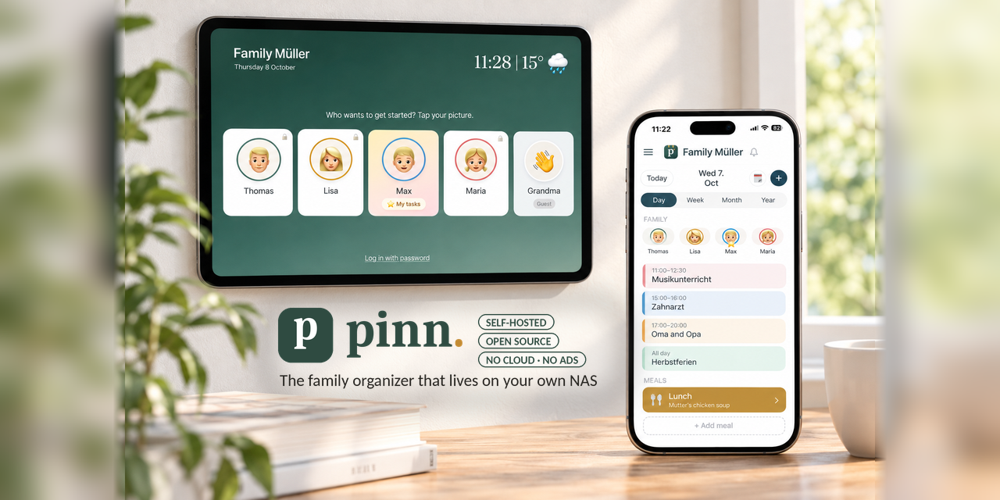
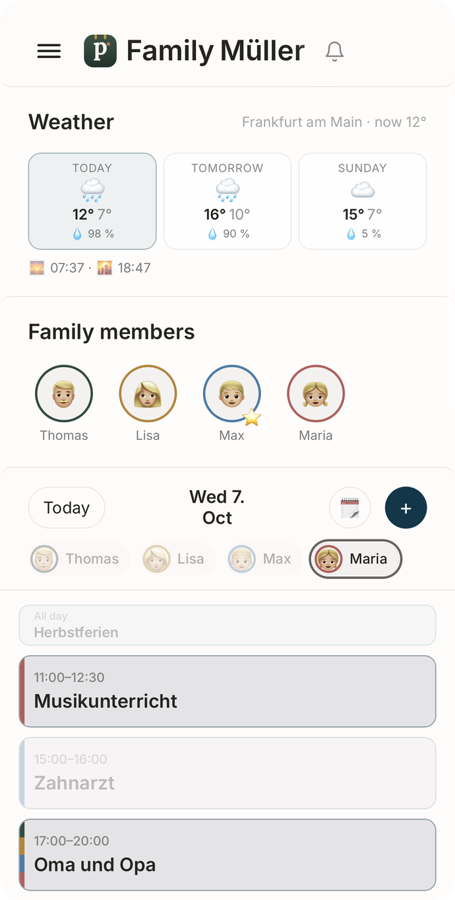
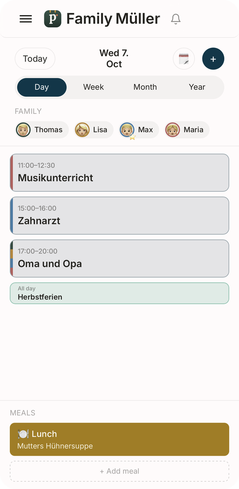
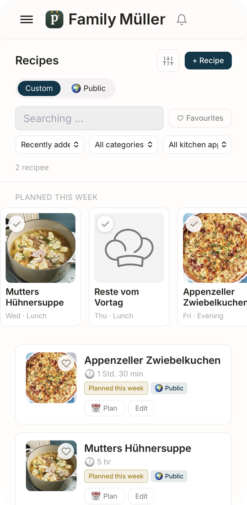
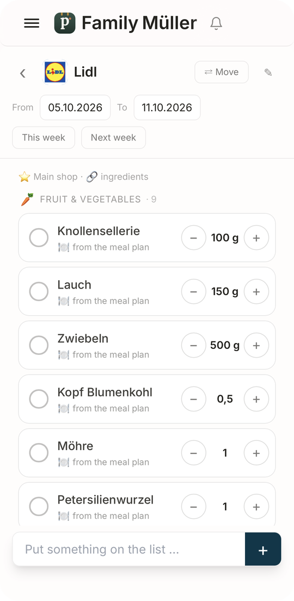
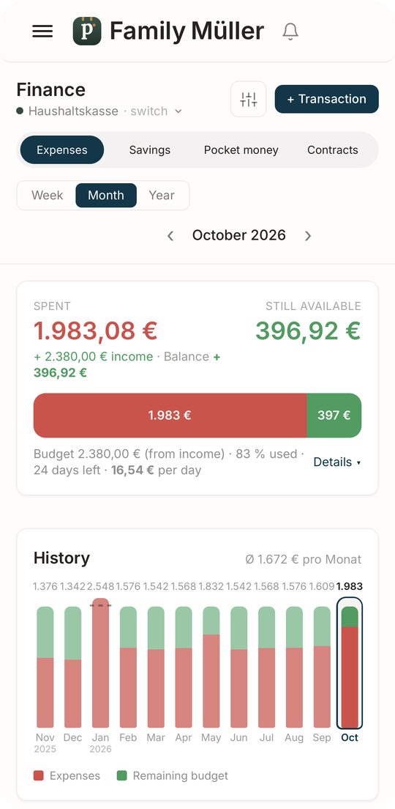
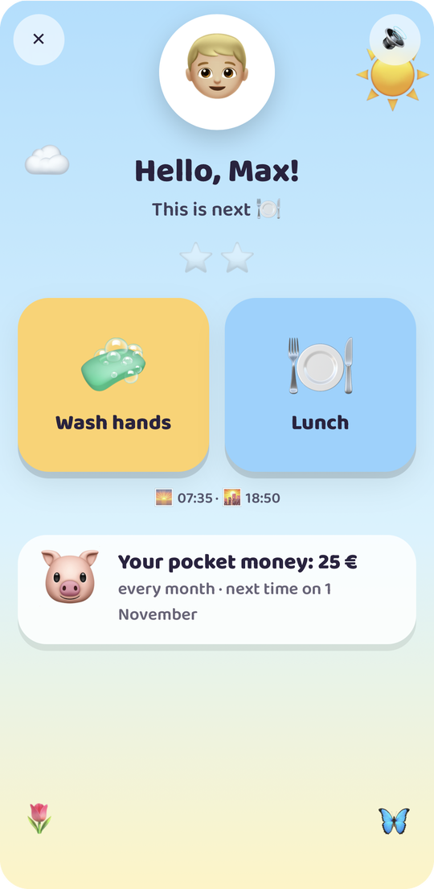
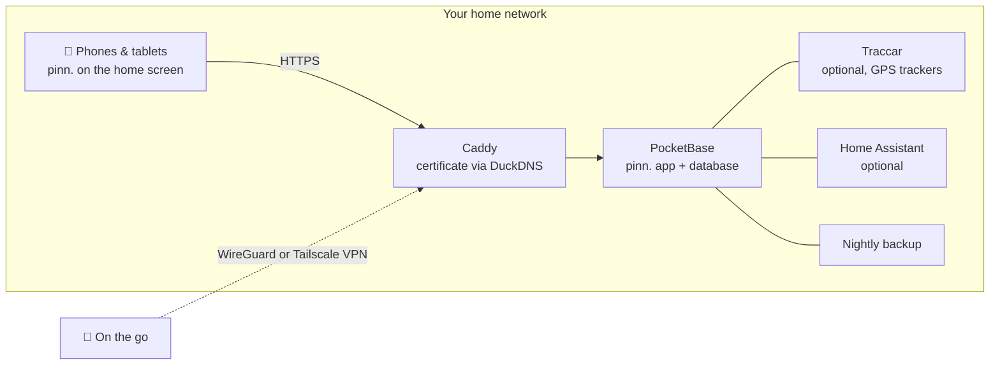

<p align="center">
  
</p>

<p align="center">
  <a href="https://github.com/pinn-shost/pinn/releases/latest"></a>
  <a href="LICENSE"></a>
  
  
  
  <a href="https://ko-fi.com/pinnapp"></a>
</p>

<p align="center">
  <a href="#screenshots">Screenshots</a> ·
  <a href="#what-pinn-does">Features</a> ·
  <a href="#installation">Installation</a> ·
  <a href="#privacy">Privacy</a> ·
  <a href="#faq">FAQ</a> ·
  <a href="README.de.md">🇩🇪 Deutsch</a>
</p>

---

pinn. is one app for everything that keeps a household running: the shared calendar, this week's meals, the shopping list, who takes out the bins, the pocket money and the insurance that needs cancelling in March. It runs on **your own NAS** with Docker and installs like a native app on every iPhone, iPad and Android phone in the family.

No cloud account. No subscription. No ads, no tracking. Your family's data never leaves your home.

## Screenshots

<table>
  <tr>
    <td align="center" width="33%"><br><sub><b>Home</b> – your day at a glance</sub></td>
    <td align="center" width="33%"><br><sub><b>Calendar</b> – iCloud and Google in one view</sub></td>
    <td align="center" width="33%"><br><sub><b>Meals</b> – plan the week, shop in one tap</sub></td>
  </tr>
  <tr>
    <td align="center"><br><sub><b>Lists</b> – shopping, pantry, packing</sub></td>
    <td align="center"><br><sub><b>Finance</b> – budget, savings, pocket money</sub></td>
    <td align="center"><br><sub><b>Kids</b> – a playful daily routine</sub></td>
  </tr>
</table>

## What pinn. does

| | |
|---|---|
| 📅 **Calendar** | iCloud and Google calendars per person, private or shared with the family. Public and school holidays, waste collection dates and birthdays from your contacts appear automatically. |
| 🍝 **Meals & recipes** | Plan the week, then send the ingredients straight to the shopping list. Import recipes from text, PDF, photos or a link – optionally with AI. Share favourite recipes with other families on your server. |
| 🛒 **Lists** | Shopping lists per shop, a pantry that refills the list when stock runs low, packing lists from templates (holiday, hospital bag, party), gift and wish lists. |
| ✅ **Tasks & household** | Tasks with push reminders, cleaning plans and bins – plus a kids' page with animated routines that only shows what fits the time of day. |
| 💶 **Finance** | Shared or private funds, a household budget, savings and depots with ETFs and shares, pocket money, recurring payments and contracts with cancellation reminders. Flatshares can split costs and see who owes whom. |
| 📄 **Documents & vehicles** | Receipts and warranties, IDs with expiry reminders. Cars and bikes with inspection dates, tyre changes, fuel use and total cost. |
| 🏡 **Home** | For tenants, owners and landlords: tenancy or purchase contract, loan, defects with photos, receipts, renovation plan, meter readings with forecast, keys, and rental income for flats, houses and garages you let out. Garden & plants with a watering plan that knows when it rained. |
| 📍 **Family & location** | Share your location right from pinn. – once or for a chosen time – and in the background via the free Traccar Client app (sends straight to pinn., no extra server). Plus a "way home" mode, an SOS alert with position and emergency numbers, emergency cards and arrival notifications for places. |
| 🎒 **School & daycare** | Per child: timetable (type it in or snap a photo – the AI fills it in), drop-off and pick-up, homework on the kids' page, parent letters with deadlines that turn into reminders, and closure days straight in the calendar. |
| 🐾 **Pets** | Profiles for dogs, cats, rabbits & co. with feeding times to tick off, walks, a "whose turn is it" rota, vaccinations and deworming with push reminders, weight chart, vet and emergency vet, a pet-sitter sheet to share and a printable "missing" poster. |
| 🌦️ **Weather & holidays** | Tap the weather tile for 14 days with details for every day. Packing lists with destination and dates show the holiday weather – forecast or typical values – and suggest what to pack. |
| 🏠 **Smart home** | Start Apple Shortcuts or Home Assistant actions from a task – the robot vacuum cleans the kitchen when the chore is due. |
| 🎙️ **Voice control** | "Hey Siri, pinn": add to the shopping list, read it out, create tasks and hear what's on today – also on Android. |
| 🔔 **Notifications** | Personal push messages on iPhone, iPad and Android, plus a notification bell that collects every change in the family. |
| 🧩 **Everything else** | Family board with movable notes, global search, offline mode with automatic sync, dark mode, iPad dashboard with profile PINs, guest account, child lock. |

pinn. speaks **English, Deutsch, Français and Español**, adapts currency and emergency numbers to your region, and switches between **family** and **flatshare** wording. One server can host several families, each with its own admins.

## What's new in 1.38

**Home, letting, garden & voice control**

- **"House" is now "Home"** – with its own animated scene instead of a road: a house with garden, fence and birds, a city with train, taxi, car, bike and plane for flats, a garage with driveway. After sunset it turns to night with moon, stars and lit windows.
- **Letting:** besides renting and owning there is now **"Let out"** – tenant with contact details, base rent, service charges and parking as recurring income in Finance, deposit, rent type, purchase and loan. Tiles for rental income, surplus and gross yield, reminders for the service charge statement and a possible rent increase, rental income in the Costs tab.
- New types: **garage / parking space** and **apartment building**.
- **Building blocks per home:** add or remove defects, costs, meters, maintenance, garden & plants and keys – the tabs adapt.
- **Garden & plants:** indoor, balcony and garden plants with a watering and feeding plan, mowing in season, "💧 Watered" with one tap. Rain counts as watering outdoors, heat brings watering forward, frost warning for pots. Garden year (fruit trees, hedge, leaves, winter storage …) as tasks, plus a garden calendar of what to sow, plant and harvest this month.
- **Keys:** which keys exist, how many and who has them.
- **Voice control** (Settings → Voice control): "Hey Siri, pinn" – add things to the shopping list, have the list read out, create tasks and ask what's on today or tomorrow. With instructions for the Siri shortcut and for Android, in all four languages.
- **Shopping list & pantry:** units switch between singular and plural automatically (1 can · 2 cans, Dose/Dosen, Glas/Gläser – "Dose(n)" is understood too). On phones, pantry items on the shopping list show just the number; weights and volumes (g, kg, ml, l …) stay.
- Fixed: the icon in the header (e.g. the key) covered the first tile in Home and Vehicles.
- Server: new `sprache.pb.js` and `pinn-sprache.js`, updated `pinn-zuhause.js` (rainfall of the last two days); language files en/fr/es updated.

### Neu in 1.38 (Deutsch)

**Zuhause, Vermietung, Garten & Sprachsteuerung**

- **Aus „Haus“ wird „Zuhause“** – mit eigener bewegter Szene statt Straße: Haus mit Garten, Zaun und Vögeln, Stadt mit Bahn, Taxi, Auto, Fahrrad und Flugzeug für Wohnungen, Garage mit Einfahrt. Nach Sonnenuntergang wird es Nacht mit Mond, Sternen und Licht in den Fenstern.
- **Vermietung:** neben Miete und Eigentum jetzt auch **„Vermietet“** – Mieter mit Kontakt, Kaltmiete, Nebenkosten und Stellplatz als regelmäßige Einnahme in Finanzen, Kaution, Mietart, Kauf und Kredit. Kacheln für Mieteinnahmen, Überschuss und Brutto-Rendite, Hinweise zur Nebenkostenabrechnung und zu einer möglichen Mieterhöhung, Mieteinnahmen im Reiter Kosten.
- Neue Arten: **Garage / Stellplatz** und **Mehrfamilienhaus**.
- **Bausteine je Zuhause:** Mängel, Kosten, Zähler, Wartung, Garten & Pflanzen und Schlüssel hinzufügen oder entfernen – die Reiter passen sich an.
- **Garten & Pflanzen:** Zimmer-, Balkon- und Gartenpflanzen mit Gieß- und Düngeplan, Rasen mähen in der Saison, „💧 Gegossen“ mit einem Tipp. Regen zählt draußen als gegossen, bei Hitze kommt das Gießen früher, Frost-Warnung für Kübel. Gartenjahr (Obstbäume, Hecke, Laub, Winterquartier …) als Aufgaben und ein Gartenkalender: was jetzt gesät, gepflanzt und geerntet wird.
- **Schlüssel:** welche Schlüssel es gibt, wie viele und wer sie hat.
- **Sprachsteuerung** (Einstellungen → Sprachsteuerung): „Hey Siri, pinn“ – Sachen auf die Einkaufsliste setzen, die Liste vorlesen lassen, Aufgaben anlegen und fragen, was heute oder morgen ansteht. Mit Anleitung für den Kurzbefehl und für Android, in allen vier Sprachen.
- **Einkaufsliste & Vorrat:** Einheiten automatisch in Einzahl oder Mehrzahl (1 Dose · 2 Dosen, Packung/Packungen, Glas/Gläser – auch „Dose(n)“ wird verstanden). Am Handy zeigt die Einkaufsliste bei Vorrats-Artikeln nur die Zahl, Gewicht und Menge (g, kg, ml, l …) bleiben stehen.
- Behoben: Das Symbol im Kopf (z. B. der Schlüssel) verdeckte bei Zuhause und Fahrzeugen die erste Kachel.
- Server: neu `sprache.pb.js` und `pinn-sprache.js`, angepasst `pinn-zuhause.js` (Regenmenge der letzten zwei Tage); Sprachdateien en/fr/es ergänzt.

## How it works



Everything runs as Docker containers on one machine. HTTPS works **without port forwarding** – the certificate is issued via a DNS check. From outside, pinn. is only reachable through your own VPN.

## Requirements

- A NAS or server with **Docker** and **Docker Compose 2.17+** – developed on a UGREEN NAS with UGOS, runs on any Linux Docker host (amd64, arm64, armv7)
- SSH access to it
- Optional but recommended: a free [DuckDNS](https://www.duckdns.org) subdomain for HTTPS – required for push notifications and installing pinn. as an app

## Installation

1. Download the ZIP of the [latest release](https://github.com/pinn-shost/pinn/releases/latest) and unzip it.
2. Create a folder on the NAS, e.g. `/volume1/docker/Pocketbase`, and put the unzipped folder (e.g. `pinn-1.22.1` or `pinn-main`) into it as it is.
3. Log in via SSH and run:
   ```sh
   cd /volume1/docker/Pocketbase && sudo sh pinn-*/pinn-setup.sh
   ```
   The script sorts every file into place, downloads the libraries for PDF import and photo text recognition, and starts pinn.
4. Open `http://<NAS-IP>:8090` → **Log in as main admin** → password `Admin` → choose your own password.
5. The **setup assistant** walks you through the rest – HTTPS, remote access via WireGuard or Tailscale, Google, AI, location and Home Assistant – step by step, in four languages.
6. Open pinn. via its HTTPS address on each phone and add it to the home screen:
   - **iPhone/iPad (Safari):** Share → *Add to Home Screen* (iOS 16.4 or later for notifications)
   - **Android (Chrome):** Settings → Notifications → *Install pinn. as an app*, or Chrome menu ⋮ → *Install app*

   Then turn on notifications on each device under **Settings → Notifications → Activate on this device**.

**Updating:** download the new ZIP, put the unzipped folder into the same folder and run `sudo sh pinn-*/pinn-setup.sh` again. Replaced files are kept in `_alt/`, your data stays untouched.

**Backups** run every night into `./backups` and are kept for 14 days.

## Privacy

pinn. was built for data you would never hand to a cloud service: bank statements, health documents, where your children are. That's why:

- **All data lives on your NAS** in a single PocketBase database. There is no pinn. server and no telemetry.
- **No scripts from third-party servers.** All code and libraries are served from your NAS.
- **Push notifications carry no content.** Apple, Google and Mozilla only deliver an empty wake-up signal; the device then fetches the message from your NAS.
- **Passwords for iCloud and Google** are stored encrypted in a locked collection.
- **Not reachable from the internet.** Remote access goes through your own VPN.

pinn. only contacts outside services for features that need them:

| Service | Used for | When |
|---|---|---|
| [Open-Meteo](https://open-meteo.com) | Weather forecast | when a home address is set |
| [OpenStreetMap Nominatim](https://nominatim.openstreetmap.org) | Turning addresses into map positions | when entering addresses |
| [OpenStreetMap tiles](https://www.openstreetmap.org) | Map background | on the location page, loaded through your NAS |
| [Google Fonts](https://fonts.google.com) | Typefaces | when the app loads |
| [OpenHolidays API](https://www.openholidaysapi.org) | Public and school holidays | when a home address is set |
| [DuckDNS](https://www.duckdns.org) | HTTPS certificate and address | if configured |
| iCloud / Google | Calendars and contacts | only for accounts you connect |
| Google Gemini | Reading recipes and documents | only if you add an API key |
| jsDelivr | One-time download of pdf.js and Tesseract | during installation only |

## FAQ

<details>
<summary><b>Do I need to open ports on my router?</b></summary>
<br>
No. The HTTPS certificate is issued via a DNS check, and remote access runs through a VPN – WireGuard on a FRITZ!Box, or Tailscale for any other router.
</details>

<details>
<summary><b>Does it work without a NAS?</b></summary>
<br>
Any always-on machine with Docker works: a mini PC, a Raspberry Pi 4/5 or a Linux server.
</details>

<details>
<summary><b>Is pinn. a "real" app from the App Store?</b></summary>
<br>
pinn. is a web app that you add to the home screen. It then opens full-screen like a native app, works offline, shows a badge with open tasks and receives push notifications – without any app store.
</details>

<details>
<summary><b>Can several families use one installation?</b></summary>
<br>
Yes. The main admin creates families, each family gets its own admins, calendars and data. Recipes can optionally be shared between families.
</details>

<details>
<summary><b>What about children?</b></summary>
<br>
Profiles with child lock only see their own tasks and can't delete or change anything. Finance, documents and vehicles stay hidden. Younger children get their own playful page with daily routines.
</details>

<details>
<summary><b>What does it cost?</b></summary>
<br>
Nothing – pinn. is free and open source under the MIT license. Optional services like the Gemini AI have free tiers.
</details>

## Contributing

Bug reports, ideas and translations are very welcome – see [CONTRIBUTING.md](.github/CONTRIBUTING.md). Please report security issues privately as described in [SECURITY.md](.github/SECURITY.md).

## Support pinn.

pinn. is free and stays free – completely, for everyone. It's built in my spare time. If it makes your everyday life a little easier, a small contribution is very welcome, but entirely voluntary:

<p>
  <a href="https://ko-fi.com/pinnapp"></a>
  <a href="https://buymeacoffee.com/pinn"></a>
</p>

A ⭐ helps too – it makes pinn. easier to find for other families.

## Built with

[PocketBase](https://pocketbase.io) (MIT) · [Tailwind CSS](https://tailwindcss.com) (MIT) · [pdf.js](https://mozilla.github.io/pdf.js/) (Apache-2.0) · [Tesseract.js](https://tesseract.projectnaptha.com) (Apache-2.0) · [Traccar](https://www.traccar.org) (Apache-2.0) · [Caddy](https://caddyserver.com) (Apache-2.0)

## License

[MIT](LICENSE) – use it, change it, share it.
