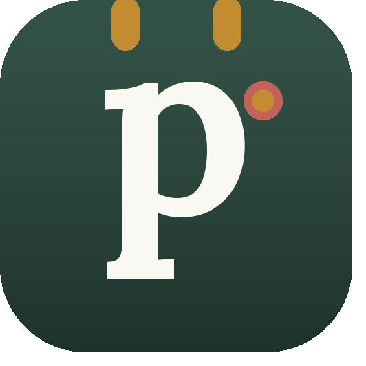

<p align="center">
  
</p>

<h1 align="center">pinn.</h1>

<p align="center">
  The self-hosted family organizer for your NAS – calendar, meals, lists, tasks and finances in one app.<br>
  <a href="#deutsch">🇩🇪 Deutsch weiter unten</a>
</p>

---

## What is pinn.?

pinn. is a web app for families and flatshares that runs entirely on your own NAS. Install it once with Docker, add it to the home screen of every phone and tablet (iPhone, iPad and Android), and everyone shares one calendar, one shopping list and one place for everything that keeps a household running. No cloud account, no ads, no tracking – your data never leaves your home.

**Highlights**

- **Calendar** – iCloud and Google calendars per profile (private or shared with the family), public and school holidays, waste collection calendar, birthdays from your contacts
- **Meals & recipes** – meal plan, recipes from text, PDF, photo or link (optional AI), shared public recipes, ingredients straight to the shopping list
- **Lists** – shopping lists per shop, pantry with minimum stock, packing lists from templates, gift and wish lists, checklists
- **Tasks & household** – tasks with push reminders, cleaning plans, bins, a playful kids' page with daily routines
- **Finance** – shared or private funds, budget, savings and depots (ETFs, shares), pocket money, contracts with cancellation reminders, split expenses for flatshares
- **Documents & vehicles** – receipts and warranties, IDs with expiry reminders, cars and bikes with MOT, service and costs
- **Family** – live location via Traccar (way home, SOS), emergency cards, places with arrival notifications
- **Smart home** – Apple Shortcuts and Home Assistant (e.g. start the robot vacuum from a task)
- **Push notifications** – on iPhone, iPad and Android: reminders, daily summary, assignments, board notes, arrivals and SOS – personal for each profile
- **Family board, notification bell, global search, offline mode, dark mode**
- **Backups & updates** – nightly rotating backups, restore and updates at the push of a button, no SSH needed
- **Languages** – English, Deutsch, Français, Español; family or flatshare mode

## Requirements

- A NAS or server with **Docker** and **Docker Compose 2.17+** (developed on a UGREEN NAS with UGOS, works on any Linux Docker host)
- SSH access to the NAS
- Optional: a free [DuckDNS](https://www.duckdns.org) subdomain for HTTPS (needed for push notifications on iPhone and Android)

## Installation

1. Download the ZIP of the [latest release](https://github.com/pinn-shost/pinn/releases/latest) (or **Code → Download ZIP**) and unzip it.
2. Create a folder on the NAS, e.g. `/volume1/docker/Pocketbase`, and put the unzipped folder (e.g. **`pinn-1.22.1`** or **`pinn-main`**) into it as it is.
3. Log in via SSH and run:
   ```sh
   cd /volume1/docker/Pocketbase && sudo sh pinn-*/pinn-setup.sh
   ```
   The script sorts all files into place, downloads the libraries for PDF import and photo text recognition, and starts pinn.
4. Open `http://<NAS-IP>:8090` in the browser → **Log in as main admin** → password `Admin` → set your own password.
5. The **setup assistant** guides you through everything else (HTTPS, remote access via WireGuard or Tailscale, Google, AI, location, Home Assistant) – step by step, in four languages.
6. Open pinn. via its HTTPS address on every phone and add it to the home screen:
   - **iPhone/iPad (Safari):** Share → *Add to Home Screen* (iOS 16.4 or later for notifications)
   - **Android (Chrome):** Settings → Notifications → *Install pinn. as an app*, or Chrome menu ⋮ → *Install app*

   Then turn on notifications per device under **Settings → Notifications → Activate on this device**.

**Updating:** in pinn. go to **Settings → System → Check for update** (main admin: **🛟 Backups & updates**) – pinn. finds the new release on GitHub, shows the release notes and installs it with one tap, including a backup beforehand. No SSH needed. The manual way still works: download the new ZIP, put the unzipped folder into the same folder again and run `sudo sh pinn-*/pinn-setup.sh`. Replaced files are backed up in `_alt/`. Your data stays untouched.

**Backups** are created automatically every night in `./backups` – all backups of the last 7 days, then one per week for 4 weeks, plus one before every update and restore. Restore any of them with one tap under **Settings → System → Backups & restore** (data only or everything).

## Support pinn.

pinn. is free and stays free – completely, for everyone. It's built in my spare time. If it makes your everyday life a little easier, a small contribution is very welcome, but entirely voluntary:

- ☕ [Ko-fi](https://ko-fi.com/pinnapp)
- ☕ [Buy Me a Coffee](https://buymeacoffee.com/pinn)

A ⭐ on GitHub helps too – it makes pinn. easier to find for other families.

Found a bug or have an idea? [Open an issue](https://github.com/pinn-shost/pinn/issues).

## Built with

[PocketBase](https://pocketbase.io) (MIT) · [Tailwind CSS](https://tailwindcss.com) (MIT) · [pdf.js](https://mozilla.github.io/pdf.js/) (Apache-2.0) · [Tesseract.js](https://tesseract.projectnaptha.com) (Apache-2.0) · [Traccar](https://www.traccar.org) (Apache-2.0) · [Caddy](https://caddyserver.com) (Apache-2.0)

## License

[MIT](LICENSE) – use it, change it, share it.

---

<a id="deutsch"></a>

## 🇩🇪 Deutsch

pinn. ist eine Familien-App, die komplett auf dem eigenen NAS läuft: Kalender, Essensplanung, Rezepte, Einkaufs- und Packlisten, Aufgaben, Finanzen, Dokumente, Fahrzeuge, Ortung, Smarthome und eine Pinnwand – für Familien und WGs, mit persönlichen Push-Benachrichtigungen auf iPhone, iPad und Android. Kein Cloud-Konto, keine Werbung, keine Weitergabe von Daten.

### Installation

1. Die ZIP des [neuesten Releases](https://github.com/pinn-shost/pinn/releases/latest) herunterladen (oder **Code → Download ZIP**) und entpacken.
2. Auf dem NAS einen Ordner anlegen, z. B. `/volume1/docker/Pocketbase`, und den entpackten Ordner (z. B. **`pinn-1.22.1`** oder **`pinn-main`**) so, wie er ist, hineinlegen.
3. Per SSH anmelden und ausführen:
   ```sh
   cd /volume1/docker/Pocketbase && sudo sh pinn-*/pinn-setup.sh
   ```
4. Im Browser `http://<NAS-IP>:8090` öffnen → **Als Hauptadmin anmelden** → Passwort `Admin` → eigenes Passwort festlegen.
5. Der **Einrichtungs-Assistent** führt Schritt für Schritt durch alles Weitere.
6. pinn. auf jedem Handy über die HTTPS-Adresse öffnen und auf den Home-Bildschirm legen:
   - **iPhone/iPad (Safari):** Teilen → *Zum Home-Bildschirm* (für Benachrichtigungen ab iOS 16.4)
   - **Android (Chrome):** Einstellungen → Benachrichtigungen → *pinn. als App installieren* oder Chrome-Menü ⋮ → *App installieren*

   Danach je Gerät unter **Einstellungen → Benachrichtigungen → Auf diesem Gerät aktivieren** die Mitteilungen einschalten.

**Update:** in pinn. unter **Einstellungen → System → Auf Update prüfen** (Hauptadmin: **🛟 Sicherungen & Updates**) – pinn. findet die neue Version auf GitHub, zeigt die Release-Notizen und spielt sie mit einem Tipp ein, vorher wird automatisch gesichert. Ohne SSH. Von Hand geht es weiterhin: neue ZIP herunterladen, den entpackten Ordner wieder in denselben Ordner legen, `sudo sh pinn-*/pinn-setup.sh` ausführen. Ersetzte Dateien landen in `_alt/`, eure Daten bleiben unverändert.

**Sicherungen** entstehen jede Nacht automatisch in `./backups` – alle der letzten 7 Tage, danach 4 Wochen lang eine pro Woche, dazu je eine vor jedem Update und jeder Wiederherstellung. Zurückholen per Knopf unter **Einstellungen → System → Sicherungen & Wiederherstellung** (nur Daten oder alles).

### pinn. unterstützen

pinn. ist kostenlos und bleibt es – vollständig, für alle. Wenn es euch den Alltag leichter macht, freue ich mich über eine kleine Unterstützung, ganz freiwillig: [Ko-fi](https://ko-fi.com/pinnapp) · [Buy Me a Coffee](https://buymeacoffee.com/pinn). Auch ein ⭐ hier auf GitHub hilft.

Fehler gefunden oder eine Idee? [Hier melden](https://github.com/pinn-shost/pinn/issues).
